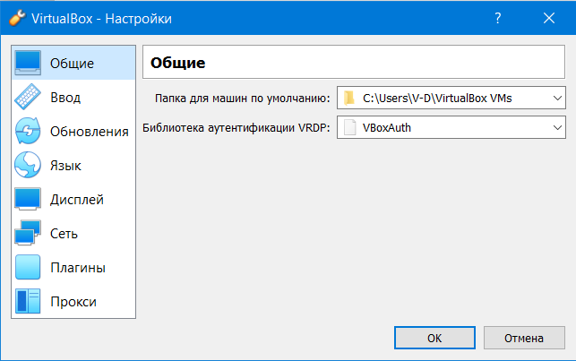
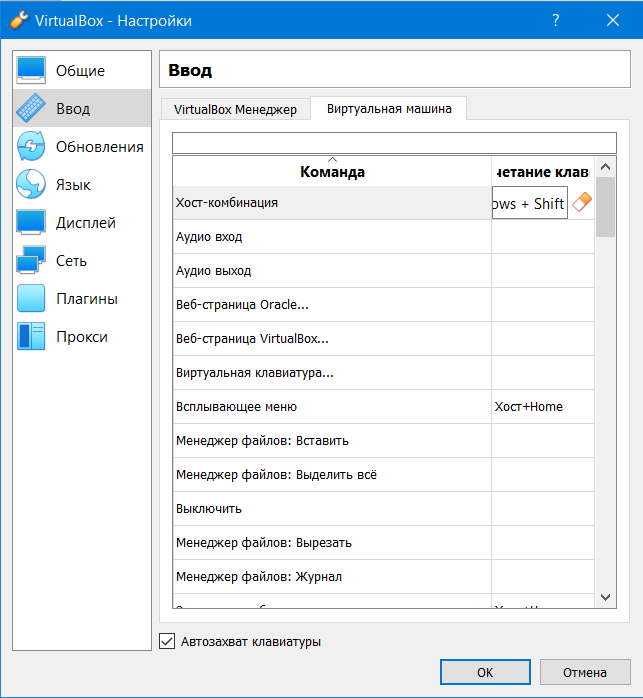
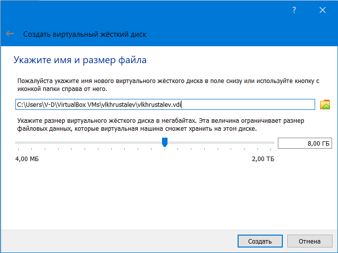
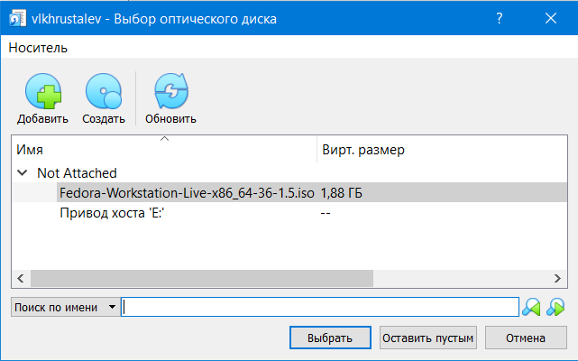
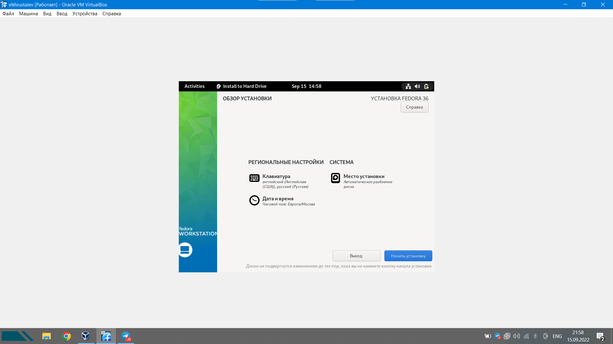
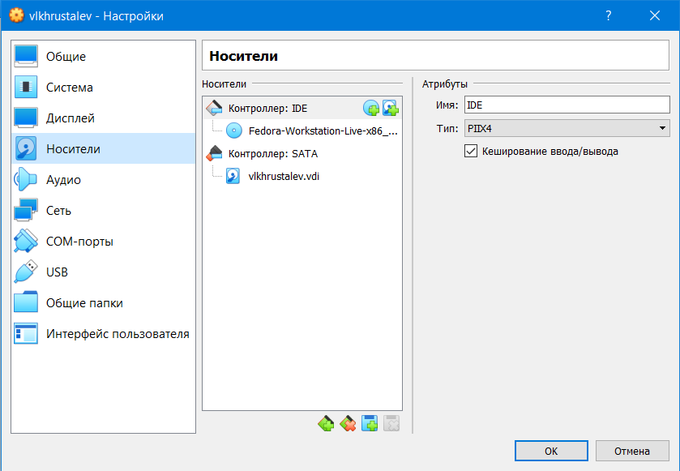
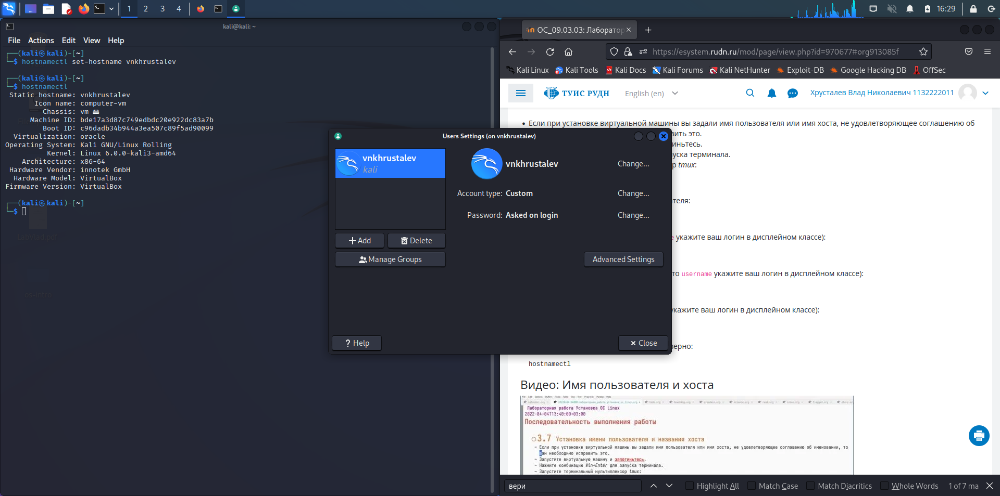
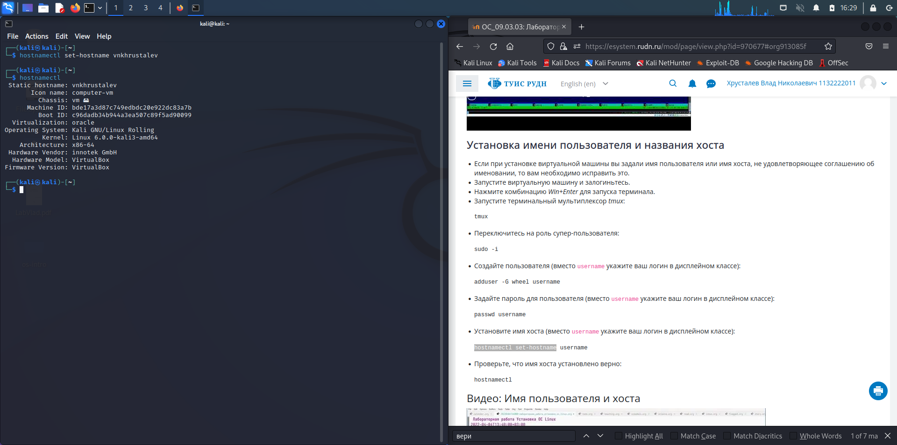
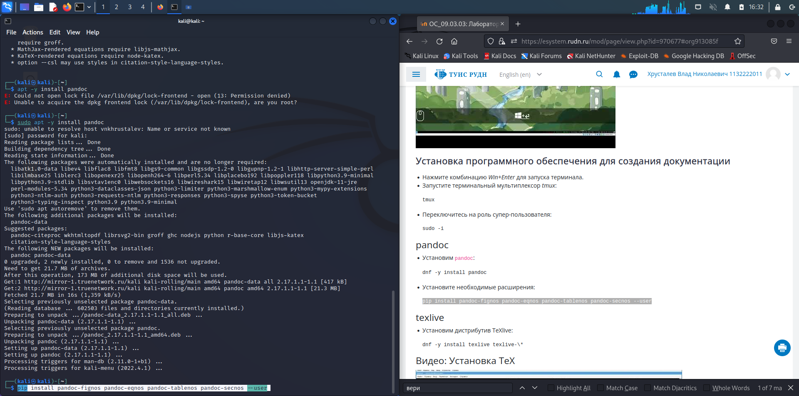

---
## Front matter
lang: ru-RU
title: презентация по лабораторной работе 1
subtitle: Установка ОС Linux
author:
  - Хрусталев В.Н.
institute:
  - Российский университет дружбы народов, Москва, Россия

## i18n babel
babel-lang: russian
babel-otherlangs: english

## Formatting pdf
toc: false
toc-title: Содержание
slide_level: 2
aspectratio: 169
section-titles: true
theme: metropolis
header-includes:
 - \metroset{progressbar=frametitle,sectionpage=progressbar,numbering=fraction}
 - '\makeatletter'
 - '\beamer@ignorenonframefalse'
 - '\makeatother'
---

# Информация

## Докладчик

:::::::::::::: {.columns align=center}
::: {.column width="70%"}

  * Хрусталев Влад Николаевич
  * Студент ФМиЕН РУДН
  * Группа НПИбд-02-22

:::
::: {.column width="30%"}

:::
::::::::::::::

# Вводная часть

## Актуальность

- Умение пользоваться Linux - очень полезный навык, для всех людей сзязанных с IT. Linux - открытая система, за счёт чего - быстрая, удобная, менее затратная.

## Цели и задачи

- Целью данной работы является приобретение практических навыков установки операционной системы на виртуальную машину, настройки минимально необходимых для дальнейшей работы сервисов.

## Содержание исследования

- Создание виртуальной машины
- Установка ОС
- Установка имени пользователя и названия хоста и программного обеспечения для создания документации

# Создание виртуальной машины

## Настройка параметров VM Box

После установки VM Box, настроим путь храненияЮ хост клавишы для удобства использования.

## Подготовка к установке системы

Перейдем на главынй экран программы -> нажмем на "+", чем создадим виртуальную машину.

Большинство параметров можем выбирать по умолчанию, но желательно оперативную память выделить побольше, мнимимум 2гб.

В имени диска системы укажем свой ник для системы

# Установка OC на Виртуальную машину

## Запуск установщика

Для ознакомления была выбрана система Fedora -> скачаем iso образ с оф. сайта.

В настройках нашего виртулаьного компьютера добавим в  виде носителя(диска) скачанный образ. 

Приступим к установке, запустив систему.

## Установка Fedora

Большинство критериев из-за наличия сети интернет в виртуальной машине, система установка опредилит сама. Поэтому отмечу основные элементы. После запуска выберем установку, во время установки добавим русскую раскладку(если сама не добавится) и укажем наше время.

## Окончание установки

После установки у нас откроется рабочий стол. Выключим систему. Откроем настройки виртуальной машины и извлечём образ установщика.

# Установка имени пользователя и названия хоста и программного обеспечения для создания документации

## Установка имени пользователя и названия хоста 

Т.к. ныне я работаю на тругой OC, то порядок дальнейших действий немного разнится с Fedora. Изменим имя пользователя через настройки и через Терминал командой "hostnamectl set-hostname Имя" изменим имя компьютера

## Установка программного обеспечения для создания документации

Установим такие утилиты, как pandoc и texlive.

"apt -y install texlive-full" - установит все пакеты texlive

"apt -y install pandoc" - установка pandoc ; установка расширений - "pip install pandoc-fignos pandoc-eqnos pandoc-tablenos pandoc-secnos --user"

# Итоги

## Вывод

- Таким образом мы сумели установить Linux на Виртуальную машину и настроить для дальнейшего выполения курса.

