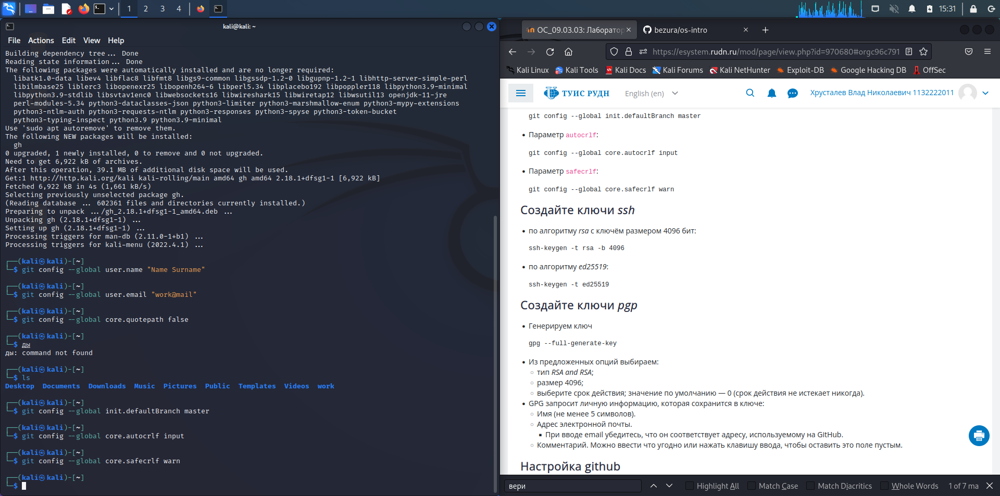
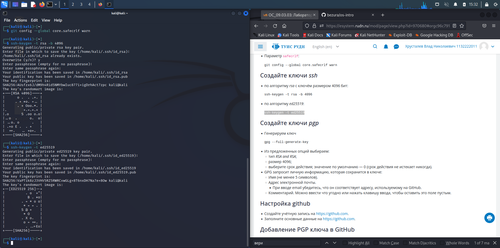
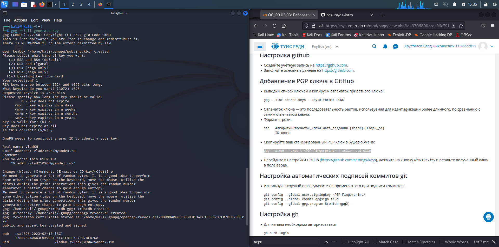
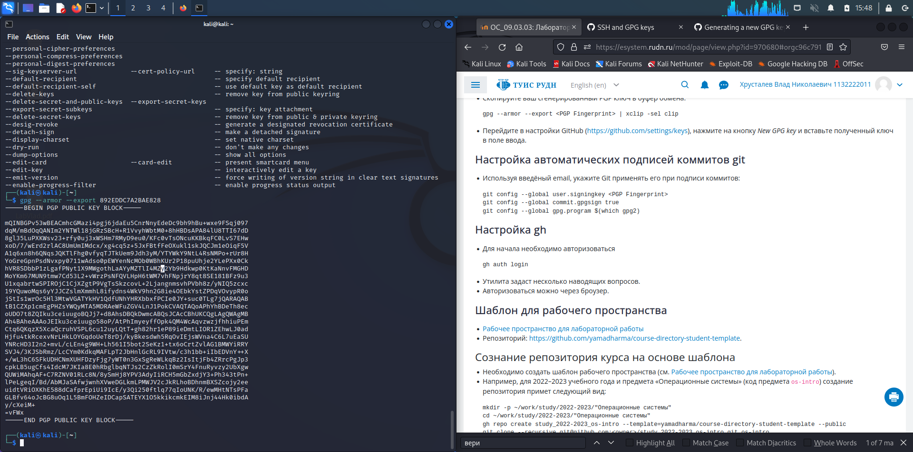
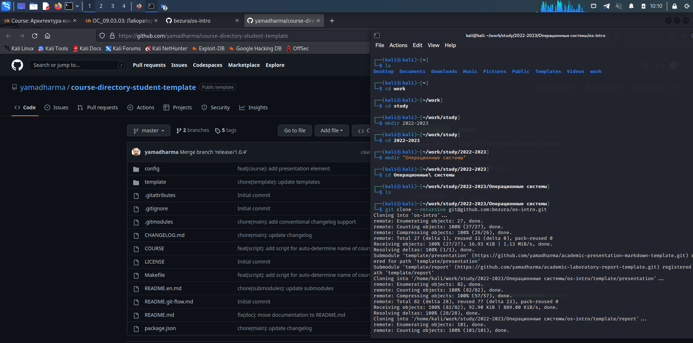

---
## Front matter
lang: ru-RU
title: презентация по лабораторной работе 1
subtitle: Первоначальна настройка git
author:
  - Хрусталев В.Н.
institute:
  - Российский университет дружбы народов, Москва, Россия

## i18n babel
babel-lang: russian
babel-otherlangs: english

## Formatting pdf
toc: false
toc-title: Содержание
slide_level: 2
aspectratio: 169
section-titles: true
theme: metropolis
header-includes:
 - \metroset{progressbar=frametitle,sectionpage=progressbar,numbering=fraction}
 - '\makeatletter'
 - '\beamer@ignorenonframefalse'
 - '\makeatother'
---

# Информация

## Докладчик

:::::::::::::: {.columns align=center}
::: {.column width="70%"}

  * Хрусталев Влад Николаевич
  * Студент ФМиЕН РУДН
  * Группа НПИбд-02-22

:::
::: {.column width="30%"}

:::
::::::::::::::

# Вводная часть

## Актуальность

- Освоение git даёт широкий спектр возможностей для будующего его применения. Например, умение пользоваться GitHub-ом очень облегчает жизнь програмисту.

## Цели и задачи

- Изучить идеалогию и примененеие средств контроля версий, в нашем случае git.

## Содержание исследования

- Первичная настройка git
- Установка свзяи между аккаунтом GitHub и Linux
- Сознание репозитория курса на основе шаблона

# Первичная настройка git

## Настройка параметров

После установки git, требуется настроить его. Для этого изменим(объявим) парочку глобальных переменных, как на скриншоте.

# Установка свзяи между аккаунтом GitHub и Linux

## Создание SSH ключей

Создадим два вида SSH ключей: rsa4096 и ed25519

Соответсвенно введя "ssh-keygen -t rsa -b 4096" и "ssh-keygen -t ed25519"

## Создание PGP ключей

Теперь создадим ключ PGP, введя команду "gpg --full-generate-key".

Из предложенных опций выбираем RSA and RSA -> 4096 -> 0

Введём Имя, Адрес почты (как в ГитХаб) - чтобы завершить создание ключа

## Добавление ключа в гитхаб

Введём "gpg --list-secret-keys --keyid-format LONG" - данная команда выведет отпечатки и др. информацию о GPG ключах в таком формате:

sec   Алгоритм/Отпечаток_ключа Дата_создания [Флаги] [Годен_до] ID_ключа 

Скопируем "Отпечаток_ключа" и вствим его в данной команде заместо <PGP Fingerprint> -> " gpg --armor --export <PGP Fingerprint>"

После этого отсается самое простое действие: Перейти в настройки GitHub (https://github.com/settings/keys), нажать на кнопку New GPG key и вставить полученный ключ в поле ввода.

# Сознание репозитория курса на основе шаблона

## Клонирование и скачаивание репозитория 

Введём данные команды создадим папку -> создадим клон репозитория -> скачаем его.

mkdir -p ~/work/study/2022-2023/"Операционные системы"

cd ~/work/study/2022-2023/"Операционные системы"

gh repo create study_2022-2023_os-intro --template=yamadharma/course-directory-student-template --public

git clone --recursive git@github.com:<owner>/study_2022-2023_os-intro.git os-intro

## Настройка каталога курса и обновления файлов сервера

Перейдем в каталог, удалим лишние файлы и создадим необходимые каталоги, введя комманды: "rm package.json" -> "echo os-intro > COURSE" -> "make".

И окончательный штрих, отправим изменнённые файлы на сервер.

"git add ." -> "git commit -am 'feat(main): make course structure'" -> "git push"

# Итоги

## Вывод

- Таким образом мы сумели разорбраться в основах Git и создать каталог для дальнейшей работы по Курсую

