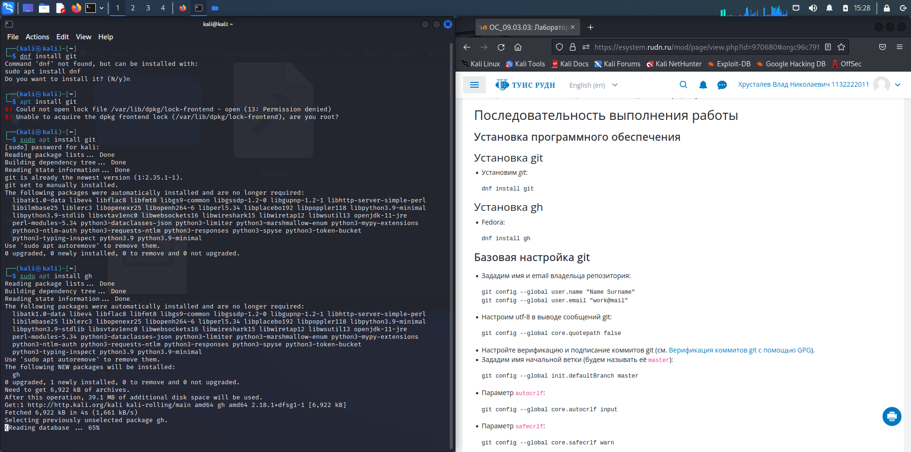
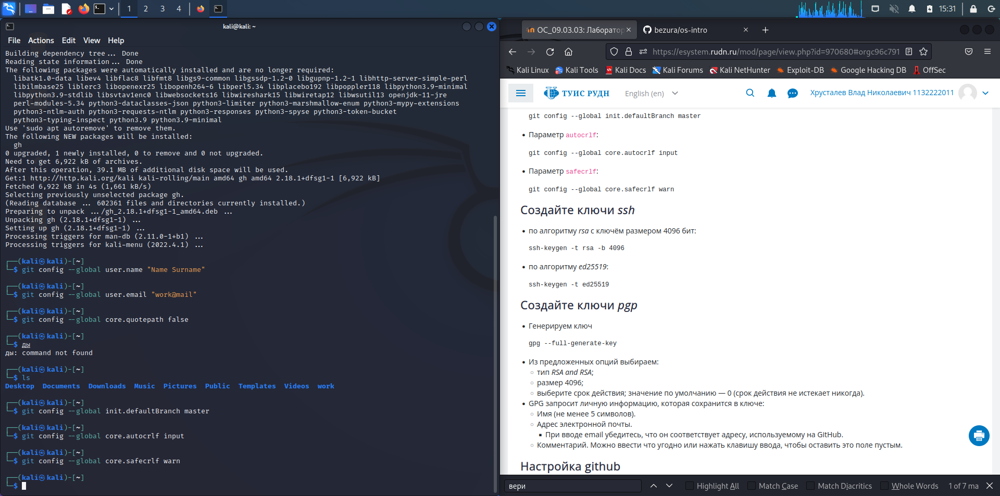
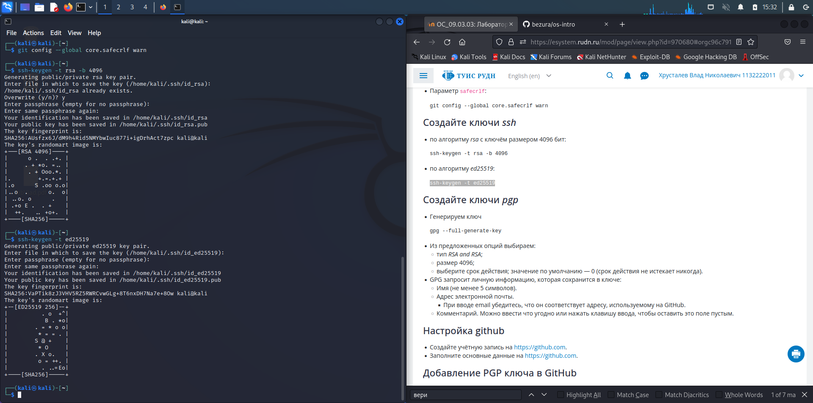
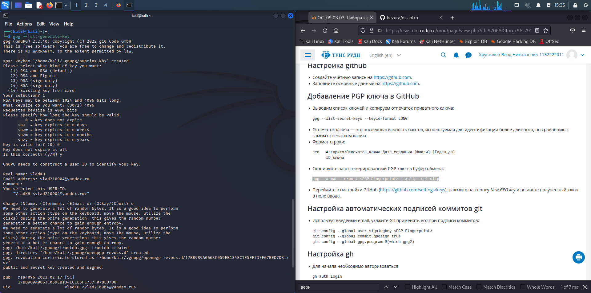
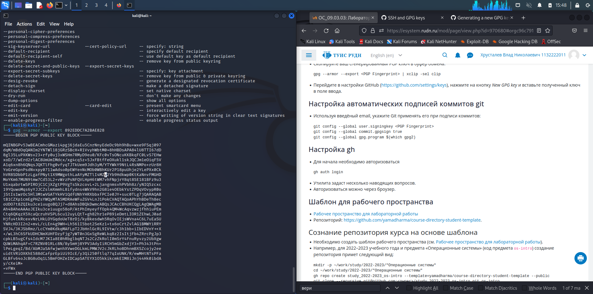
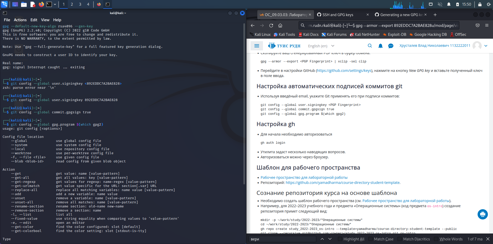
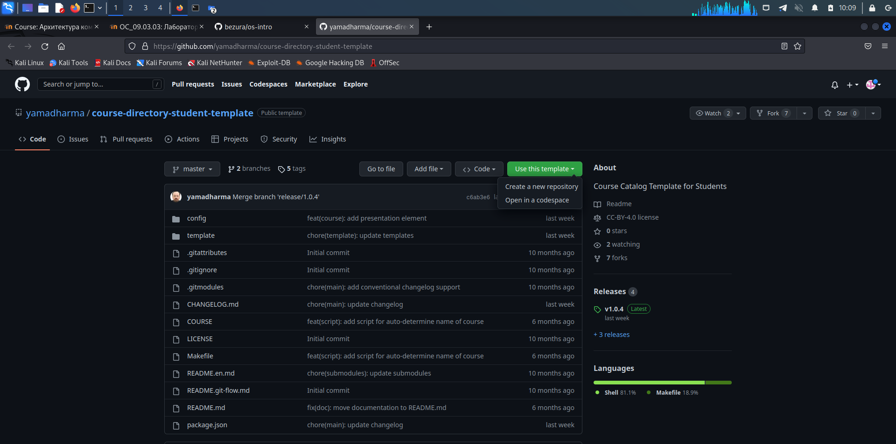
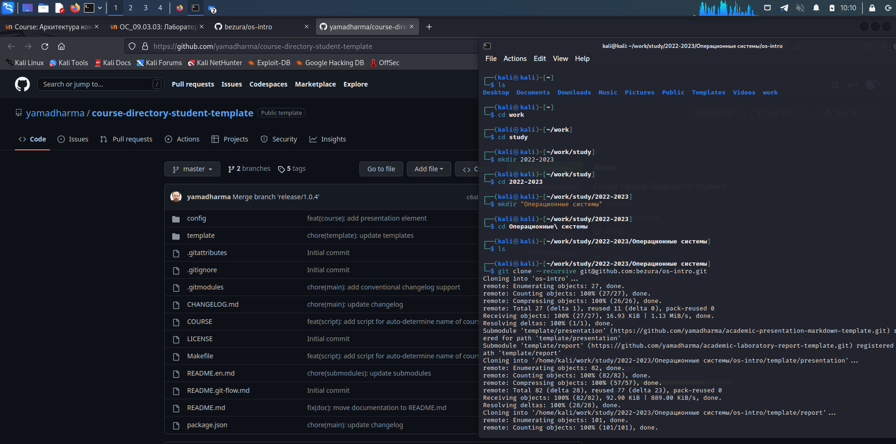
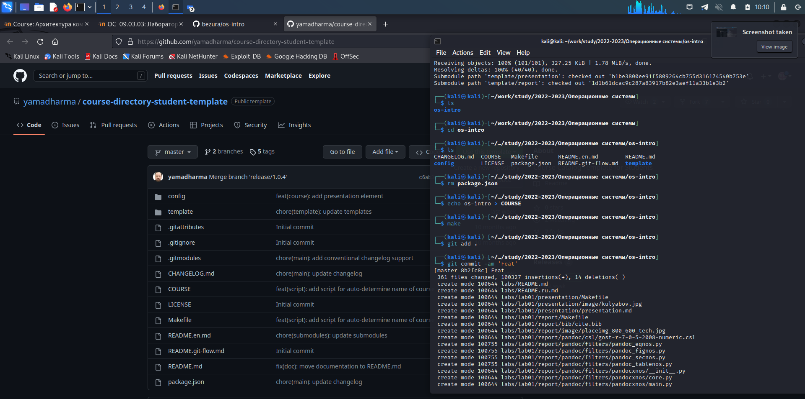
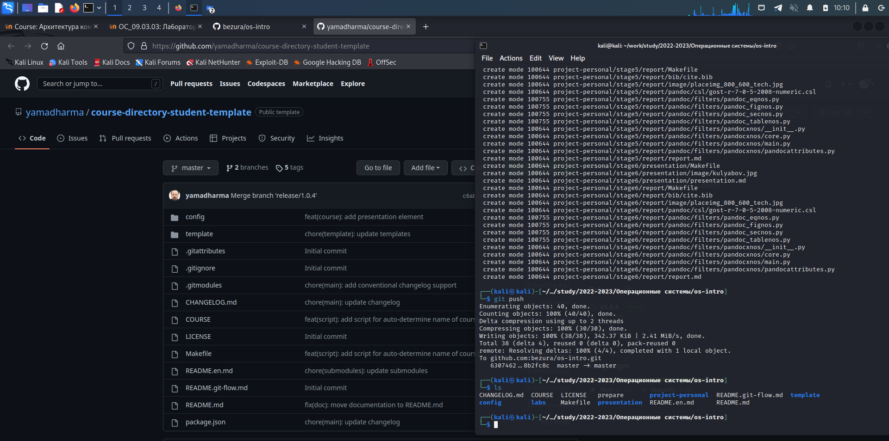

---
## Front matter
title: "Лабараторная работа 2"
subtitle: "Первоначальна настройка git"
author: "Хрусталев Влад Николаевич"

## Generic otions
lang: ru-RU
toc-title: "Содержание"

## Bibliography
bibliography: bib/cite.bib
csl: pandoc/csl/gost-r-7-0-5-2008-numeric.csl

## Pdf output format
toc: true # Table of contents
toc-depth: 2
lof: true # List of figures
fontsize: 12pt
linestretch: 1.5
papersize: a4
documentclass: scrreprt
## I18n polyglossia
polyglossia-lang:
  name: russian
  options:
	- spelling=modern
	- babelshorthands=true
polyglossia-otherlangs:
  name: english
## I18n babel
babel-lang: russian
babel-otherlangs: english
## Fonts
mainfont: PT Serif
romanfont: PT Serif
sansfont: PT Sans
monofont: PT Mono
mainfontoptions: Ligatures=TeX
romanfontoptions: Ligatures=TeX
sansfontoptions: Ligatures=TeX,Scale=MatchLowercase
monofontoptions: Scale=MatchLowercase,Scale=0.9
## Biblatex
biblatex: true
biblio-style: "gost-numeric"
biblatexoptions:
  - parentracker=true
  - backend=biber
  - hyperref=auto
  - language=auto
  - autolang=other*
  - citestyle=gost-numeric
## Pandoc-crossref LaTeX customization
figureTitle: "Рис."
tableTitle: "Таблица"
listingTitle: "Листинг"
lofTitle: "Список иллюстраций"
lotTitle: "Список таблиц"
lolTitle: "Листинги"
## Misc options
indent: true
header-includes:
  - \usepackage{indentfirst}
  - \usepackage{float} # keep figures where there are in the text
  - \floatplacement{figure}{H} # keep figures where there are in the text
---

# Цель работы

Изучить идеологию и применение средств контроля версий.

Освоить умения по работе с git.

# Выполнение лабораторной работы

Установим git и gh.(рис. [@fig:005])

{#fig:005 width=70%}

Первичная настройка git по инструкции(рис. [@fig:006])

{#fig:006 width=70%}

Создание двух ключей с алгоритмами rsa 4096 и ed25519(рис. [@fig:007])

{#fig:007 width=70%}

Создание PGP ключа(рис. [@fig:008])

{#fig:008 width=70%}

Теперь скопируем готовый ключ и добавим на сайте github в GPG keys.(рис. [@fig:010])

{#fig:010 width=70%}

Завершим настройку git.(рис. [@fig:011])

{#fig:011 width=70%}

Теперь открою репозиторий-шаблон и скопирую к себе.(рис. [@fig:001]).

{#fig:001 width=70%}

Создадим нужную иерархию и скопируем репозиторий(рис. [@fig:002]).

{#fig:002 width=70%}

Удалим ненужные файлы и запустим файл make для настройки репозитория(рис. [@fig:003]).

{#fig:003 width=70%}

Далее загрузим обратно в гитхаб(рис. [@fig:004])

{#fig:004 width=70%}

#Контрольные вопросы

1)Что такое системы контроля версий (VCS) и для решения каких задач они предназначаются?
    
Место где храняться какие-либо данные и к которому можно получить доступ, менять(сохраняя историю изменений). Используется для написания больших программ командой разрабочиков и в многих других задачах
    
2)Объясните следующие понятия VCS и их отношения: хранилище, commit, история, рабочая копия.

Хранилище - то место что является эталоном

Commit - коментарий к изменным файлам

История - кто когда и что редактировал

Рабочая копия - копия на ПК, в которой производятся изменения, а далее обратно выгружается на сервер

3)Что представляют собой и чем отличаются централизованные и децентрализованные VCS? Приведите примеры VCS каждого вида.

В отличие от классических, в распределённых системах контроля версий центральный репозиторий не является обязательным. 
Среди классических VCS наиболее известны CVS, Subversion, а среди распределённых — Git, Bazaar, Mercurial. Принципы их работы схожи, отличаются они в основном синтаксисом используемых в работе команд.

4)Опишите действия с VCS при единоличной работе с хранилищем.

Один человек загрузил и выгрузил обратно. Хранилище у него на пк(вероятнее всего)

5)Опишите порядок работы с общим хранилищем VCS.

Хоть сколько человек загрузили и обновии данные. Сохраняется кто что изменял.

6)Каковы основные задачи, решаемые инструментальным средством git?

История изменнений, лёгкость правок и отката.

7)Назовите и дайте краткую характеристику командам git.

    Перечислим наиболее часто используемые команды git.

    Создание основного дерева репозитория:

    git init

    Получение обновлений (изменений) текущего дерева из центрального репозитория:

    git pull

    Отправка всех произведённых изменений локального дерева в центральный репозиторий:

    git push

    Просмотр списка изменённых файлов в текущей директории:

    git status

    Просмотр текущих изменений:

    git diff

    Сохранение текущих изменений:

        добавить все изменённые и/или созданные файлы и/или каталоги:

        git add .

        добавить конкретные изменённые и/или созданные файлы и/или каталоги:

        git add имена_файлов

        удалить файл и/или каталог из индекса репозитория (при этом файл и/или каталог остаётся в локальной директории):

        git rm имена_файлов

    Сохранение добавленных изменений:

        сохранить все добавленные изменения и все изменённые файлы:

        git commit -am 'Описание коммита'

        сохранить добавленные изменения с внесением комментария через встроенный редактор:

        git commit

        создание новой ветки, базирующейся на текущей:

        git checkout -b имя_ветки

        переключение на некоторую ветку:

        git checkout имя_ветки

            (при переключении на ветку, которой ещё нет в локальном репозитории, она будет создана и связана с удалённой)

        отправка изменений конкретной ветки в центральный репозиторий:

        git push origin имя_ветки

        слияние ветки с текущим деревом:

        git merge --no-ff имя_ветки

    Удаление ветки:

        удаление локальной уже слитой с основным деревом ветки:

        git branch -d имя_ветки

        принудительное удаление локальной ветки:

        git branch -D имя_ветки

        удаление ветки с центрального репозитория:

        git push origin :имя_ветки

    8)Приведите примеры использования при работе с локальным и удалённым репозиториями.
    
    Локальный репозиторий - фрилансер один пишет код.
    
    Удалённый репозиторий - например на гитхабе репозиторий большого проекта команды разработчиков.
    
    9)Что такое и зачем могут быть нужны ветви (branches)?
    История изменений, правок - даёёт удобство. Или же можно посмотреть вариацию изменений одного куска кода( текста) и т.д.
    
    10)Как и зачем можно игнорировать некоторые файлы при commit?
    
    Не изменные файлы остаются такими же

# Выводы

На данной лабороторной, я закрепил знания полученные в прошлом семестре по работе с git.
