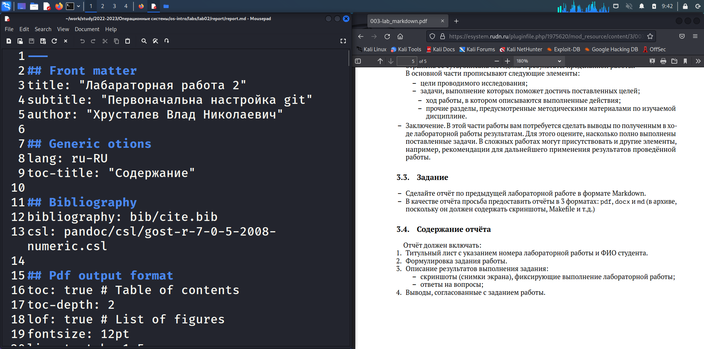
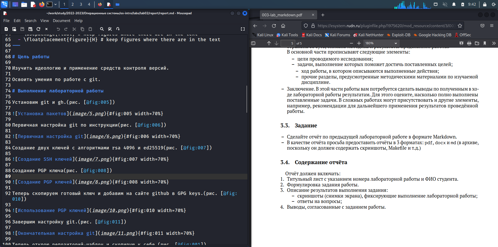
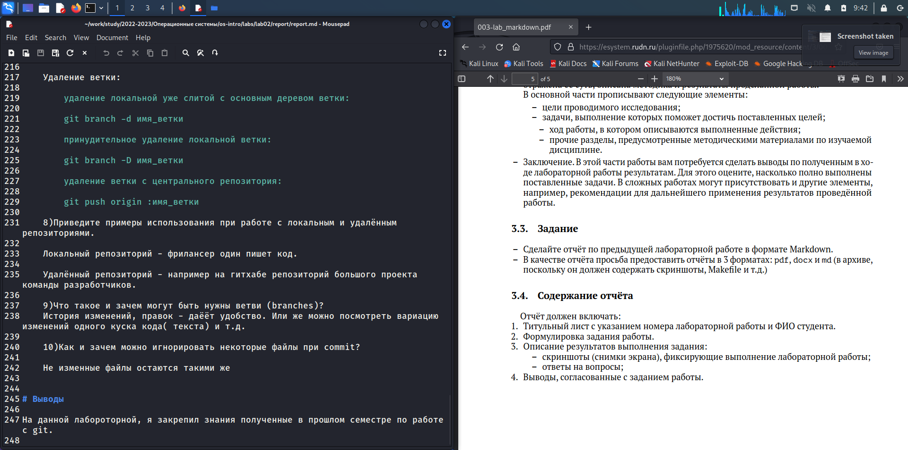

---
## Front matter
lang: ru-RU
title: презентация по лабораторной работе 3
subtitle: Markdown
author:
  - Хрусталев В.Н.
institute:
  - Российский университет дружбы народов, Москва, Россия

## i18n babel
babel-lang: russian
babel-otherlangs: english

## Formatting pdf
toc: false
toc-title: Содержание
slide_level: 2
aspectratio: 169
section-titles: true
theme: metropolis
header-includes:
 - \metroset{progressbar=frametitle,sectionpage=progressbar,numbering=fraction}
 - '\makeatletter'
 - '\beamer@ignorenonframefalse'
 - '\makeatother'
---

# Информация

## Докладчик

:::::::::::::: {.columns align=center}
::: {.column width="70%"}

  * Хрусталев Влад Николаевич
  * Студент ФМиЕН РУДН
  * Группа НПИбд-02-22

:::
::: {.column width="30%"}

:::
::::::::::::::

# Вводная часть

## Цели и задачи

- Научиться оформлять отчёты с помощью легковесного языка разметки Markdown.

## Содержание исследования

- Оформление отчёта по лабораторной 3 в MD

- Компиляция в pdf и docx

# Оформление отчёта по лабораторной 3 в MD

## Оформление титульного листа

Откроем файл report.md для второй лабы. Для начала изменим титульный лист. То есть блок FRONT MATTERS.

{#fig:001 width=70%}

## Оформление Цели и Выполнения работы

Запишем цель исходя из лабораторной 2. Так же приступим к оформлению Хода выболнения работы. Стараемся к каждому действию прикрепить иллюстрацию.

{#fig:002 width=70%}

## Оформление вывода

В окончании офрмления работы запишем вывод исходя из цели.

{#fig:003 width=70%}

# Компиляция в pdf и docx

И завершим коспиляцией в pdf и docx. Для этого откроем терминал в папке с report.md и пропишем команду "make". Готово

# Итоги

## Вывод

- Научились оформлять отчёты с помощью MarkDown на примере выполненной работы 2

