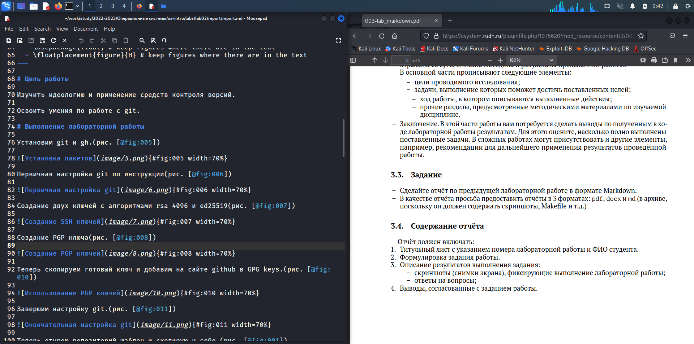
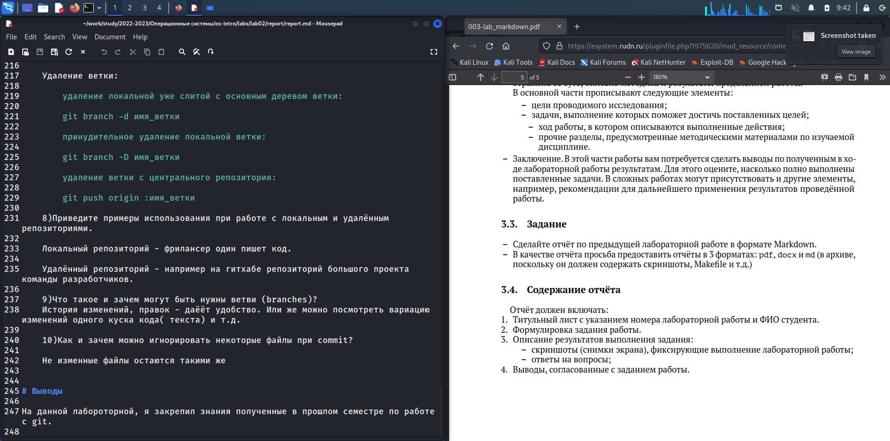

---
## Front matter
title: "Лабораторная работа No 3"
subtitle: "Markdown"
author: "Хрусталев Влад Николаевич"

## Generic otions
lang: ru-RU
toc-title: "Содержание"

## Bibliography
bibliography: bib/cite.bib
csl: pandoc/csl/gost-r-7-0-5-2008-numeric.csl

## Pdf output format
toc: true # Table of contents
toc-depth: 2
lof: true # List of figures
lot: true # List of tables
fontsize: 12pt
linestretch: 1.5
papersize: a4
documentclass: scrreprt
## I18n polyglossia
polyglossia-lang:
  name: russian
  options:
	- spelling=modern
	- babelshorthands=true
polyglossia-otherlangs:
  name: english
## I18n babel
babel-lang: russian
babel-otherlangs: english
## Fonts
mainfont: PT Serif
romanfont: PT Serif
sansfont: PT Sans
monofont: PT Mono
mainfontoptions: Ligatures=TeX
romanfontoptions: Ligatures=TeX
sansfontoptions: Ligatures=TeX,Scale=MatchLowercase
monofontoptions: Scale=MatchLowercase,Scale=0.9
## Biblatex
biblatex: true
biblio-style: "gost-numeric"
biblatexoptions:
  - parentracker=true
  - backend=biber
  - hyperref=auto
  - language=auto
  - autolang=other*
  - citestyle=gost-numeric
## Pandoc-crossref LaTeX customization
figureTitle: "Рис."
tableTitle: "Таблица"
listingTitle: "Листинг"
lofTitle: "Список иллюстраций"
lotTitle: "Список таблиц"
lolTitle: "Листинги"
## Misc options
indent: true
header-includes:
  - \usepackage{indentfirst}
  - \usepackage{float} # keep figures where there are in the text
  - \floatplacement{figure}{H} # keep figures where there are in the text
---

# Цель работы

Научиться оформлять отчёты с помощью легковесного языка разметки Markdown.

# Задание

-Сделайте отчёт по предыдущей лабораторной работе в формате Markdown.

– В качестве отчёта просьба предоставить отчёты в 3 форматах: pdf, docx и md (в архиве,
поскольку он должен содержать скриншоты, Makefile и т.д.)

# Теоретическое введение

 Структура отчёта

Согласно ГОСТ 7.32-2001, любая научно-исследовательская работа должна обязательно содержать следующие элементы:

– титульный лист;

– реферат;

– введение;

– основную часть;

– заключение.

Также ГОСТ рекомендует включить в работу и такие элементы:

– список исполнителей;

– содержание;

– нормативные ссылки;

– определения;

– обозначения и сокращения;

– список использованных источников;

– приложения.

Если вы проводите сложную работу, выполняемую в несколько этапов, то вам можетпонадобиться включить в работу часть или все элементы второго списка.

Содержание основных элементов отчета

– Титульный лист. Первый лист работы оформляется строго по образцу, который обычно приводится в методических пособиях по вашему предмету. В нем не просто требуется указать такие элементы, как название образовательного учреждения, вид работы и сведения об исполнителе, но и расположить их в строгом соответствии со стандартами.

– Реферат. Реферат фактически является кратким представлением всего вашего отчета и содержит ряд статистических сведений. В нем нужно указать количество частей, страниц работы, иллюстраций, приложений, таблиц, использованных литературных источников и приложений. Здесь же приводится перечень ключевых слов работы и собственно текст реферата. Последний подразумевает основные элементы работы от поставленных целей до результатов и рекомендаций по их внедрению. В практике вузов в отчеты по лабораторным работам реферат обычно не включают.

– Введение. Во введении типовой лабораторной работы обычно прописывают цели проводимого исследования и задачи, выполнение которых поможет достичь поставленных целей. В то же время существуют работы, в которых студенты становятся настоящими первооткрывателями. Приходилось ли вам хотя бы однажды испытывать чувство крайнего любопытства и нетерпения при проведении лабораторной работы? Ощущать, что буквально через пару минут вы найдете ответ на вопрос, на который еще никто и никогда не находил ответа? Именно для таких исследований пишется раз- вернутое введение с доказательством актуальности и новизны изучаемой темы. Чтобы действительно провести исследование в той области, в которой, как говорится, еще не ступала нога человека, во введении вам понадобится привести оценку современного состояния рассматриваемой проблемы и обосновать необходимость ее решения.

– Основная часть. Так как в разных вузах и в разных дисциплинах существуют свои
тонкости проведения лабораторных работ, содержание основной части подробно
описывают в соответствующих методичках. Важно, чтобы в этом разделе работы была
отражена ее суть, описана методика и результаты проделанной работы.

В основной части прописывают следующие элементы:

– цели проводимого исследования;

– задачи, выполнение которых поможет достичь поставленных целей;

– ход работы, в котором описываются выполненные действия;

– прочие разделы, предусмотренные методическими материалами по изучаемой дисциплине.

– Заключение. В этой части работы вам потребуется сделать выводы по полученным в ходе лабораторной работы результатам. Для этого оцените, насколько полно выполнены поставленные задачи. В сложных работах могут присутствовать и другие элементы, например, рекомендации для дальнейшего применения результатов проведённой работы.

# Выполнение лабораторной работы

Откроем файл report.md для второй лабы. Для начала изменим титульный лист. То есть блок FRONT MATTERS.(рис. @fig:001).

{#fig:001 width=70%}

Запишем цель исходя из лабораторной 2. Так же приступим к оформлению Хода выболнения работы. Стараемся к каждому действию прикрепить иллюстрацию. (рис. @fig:002).

{#fig:002 width=70%}

В окончании офрмления работы запишем вывод исходя из цели (рис. @fig:003).

{#fig:003 width=70%}

И завершим коспиляцией в pdf и docx. Для этого откроем терминал в папке с report.md и пропишем команду "make". Готово

# Выводы

Научились оформлять отчёты с помощью MarkDown.
