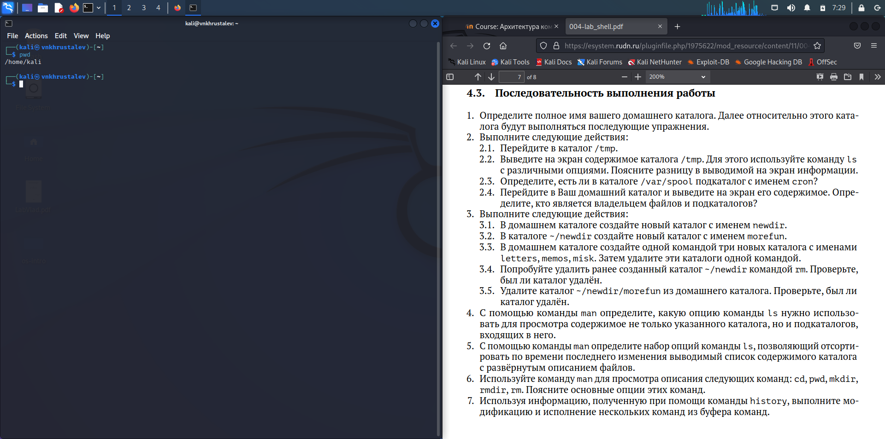
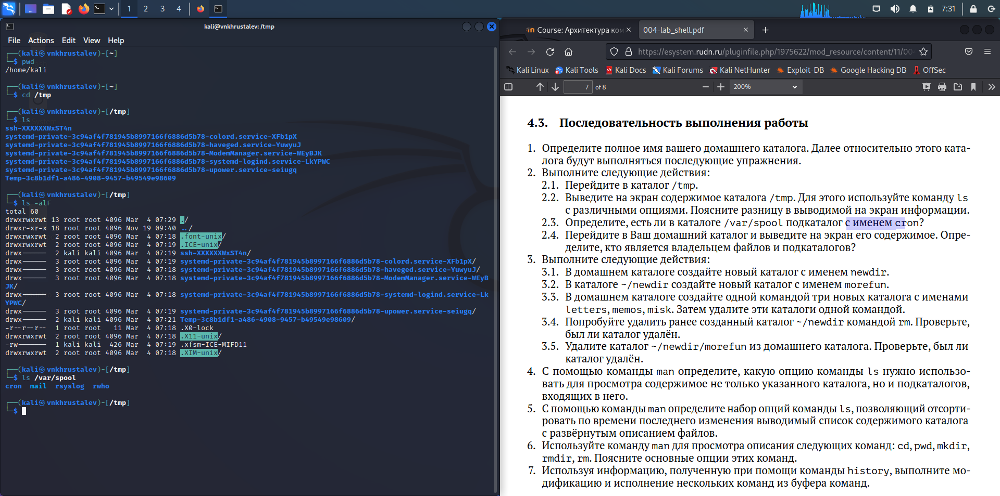
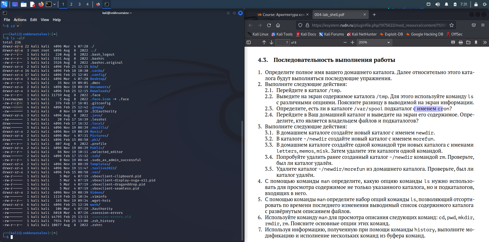
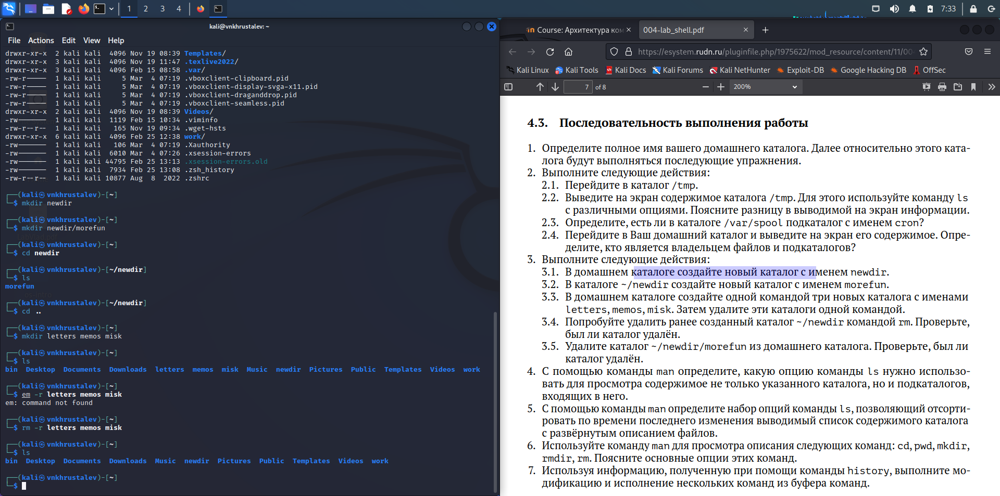
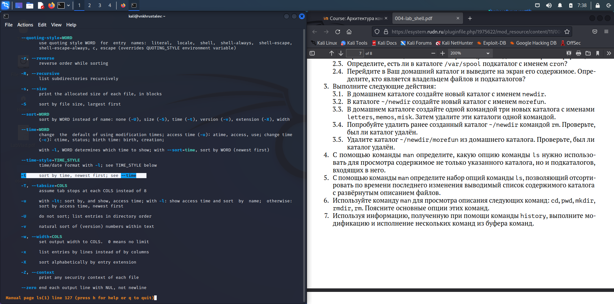
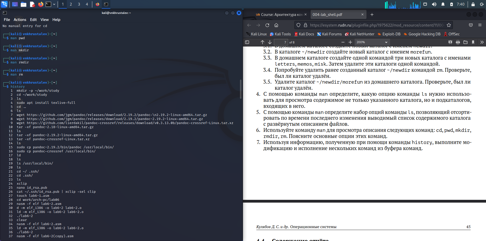

---
## Front matter
lang: ru-RU
title: презентация по лабораторной работе 4
subtitle: Markdown
author:
  - Хрусталев В.Н.
institute:
  - Российский университет дружбы народов, Москва, Россия

## i18n babel
babel-lang: russian
babel-otherlangs: english

## Formatting pdf
toc: false
toc-title: Содержание
slide_level: 2
aspectratio: 169
section-titles: true
theme: metropolis
header-includes:
 - \metroset{progressbar=frametitle,sectionpage=progressbar,numbering=fraction}
 - '\makeatletter'
 - '\beamer@ignorenonframefalse'
 - '\makeatother'
---

# Информация

## Докладчик

:::::::::::::: {.columns align=center}
::: {.column width="70%"}

  * Хрусталев Влад Николаевич
  * Студент ФМиЕН РУДН
  * Группа НПИбд-02-22

:::
::: {.column width="30%"}

:::
::::::::::::::

# Вводная часть

## Цели и задачи

- Приобретение практических навыков взаимодействия пользователя с системой посредством командной строки.

## Содержание исследования

- Определим командой pwd полное имя домашего каталога.

- Отработка команд cd и ls

- Упражнение в создание и удалении каталогов

- Команда man

- Команда history

# Определим командой pwd полное имя домашего каталога.

Определим командой pwd полное имя домашего каталога. У меня называется kali, а полный путь /home/kali/

{#fig:001 width=70%}

# Отработка команд cd и ls

ерейдем в каталог /tmp и выведем его содеривмое двумя командами. ls и ls -alF. Первая выводит видимые названия файлов и каталогов, а вторая вывод все файлы и каталоги, в том числе и скрытые с полной информацие о доступе, владельце и дате последнего редактирования. Так же командой ls /var/spool убедимся в наличие подкаталога в указанном каталоге с названием cron.  Далее посмотрим содержимое домашнего каталога и определим, что владельцем папок и фалов является пользователь kali.

{#fig:002 width=70%}

{#fig:003 width=70%}

# Упражнение в создание и удалении каталогов

{#fig:005 width=70%}

# Команда man

Командой man выясним ключ к ls для сортровки вывода по дате редактирования с развёрнутым описанием файлов - это опции -t -l.

{#fig:008 width=70%}

# Команда history

Командой history посмотрим информацию о вводимых командах. Стрелками вверх и вниз выберем команду, отредактируем её и выполним. в моем члучае ls -a.

{#fig:010 width=70%}

# Компиляция в pdf и docx

И завершим коспиляцией в pdf и docx. Для этого откроем терминал в папке с report.md и пропишем команду "make". Готово

# Итоги

## Вывод

- Углубленно изучили основные команды работы в командной строке

