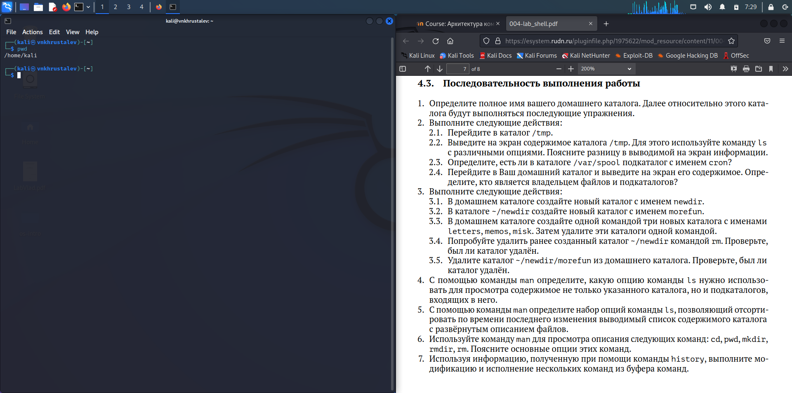
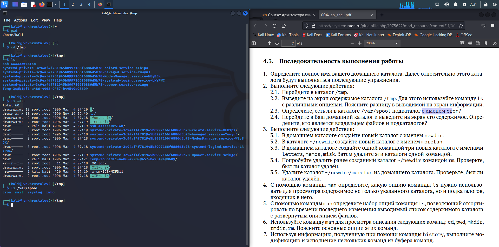
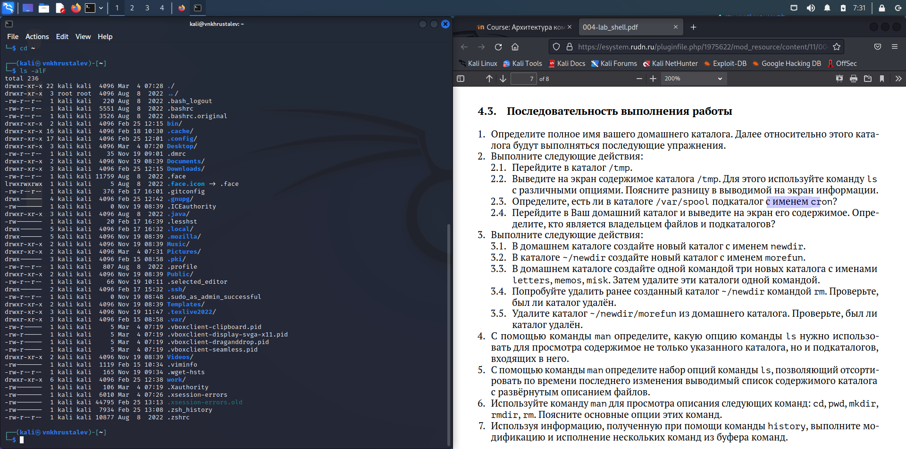
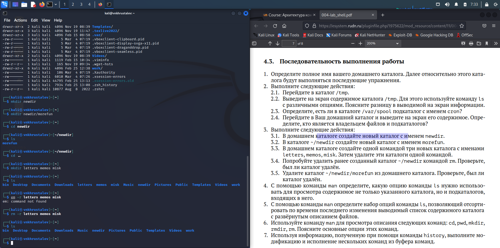
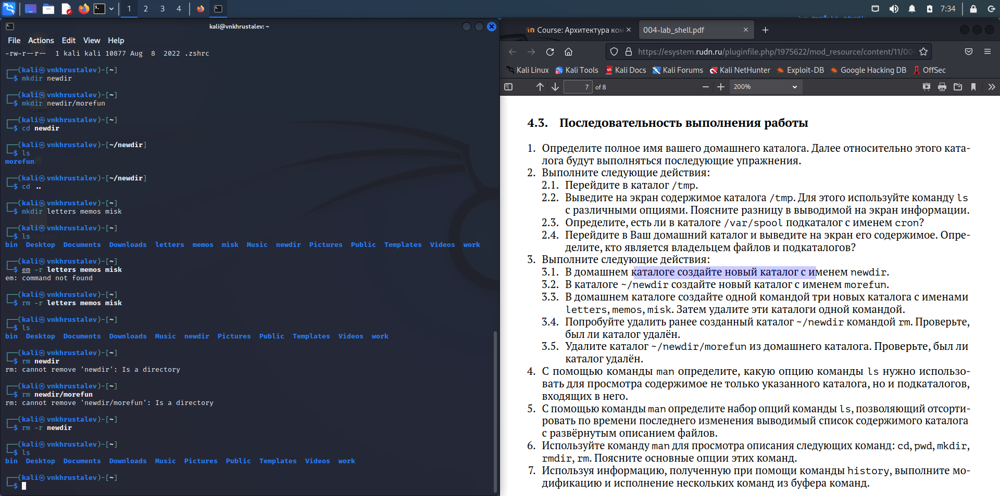
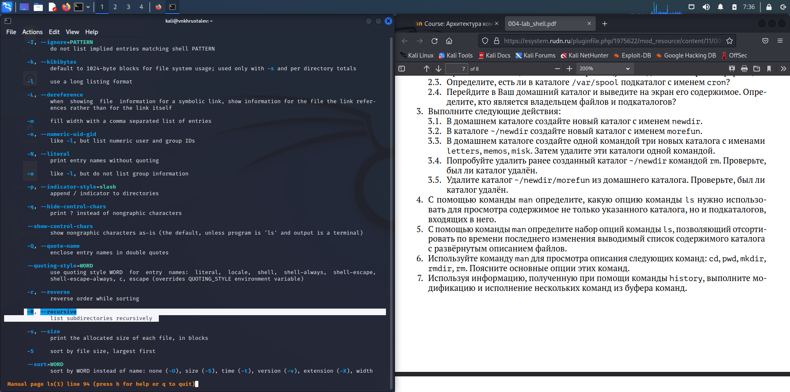
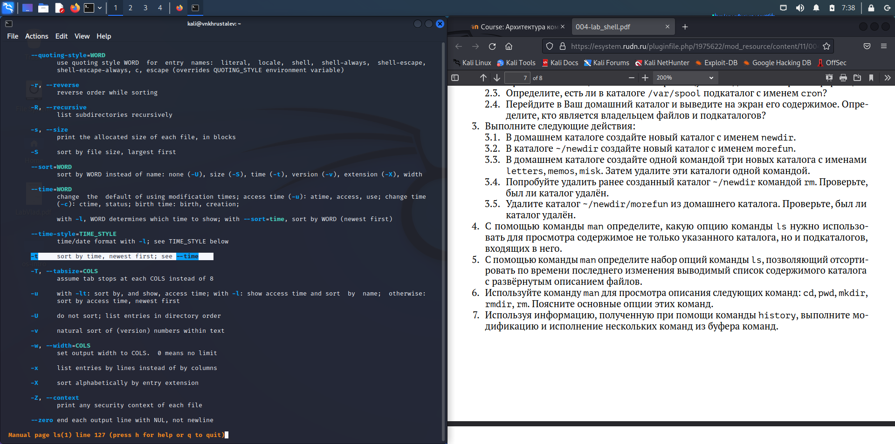
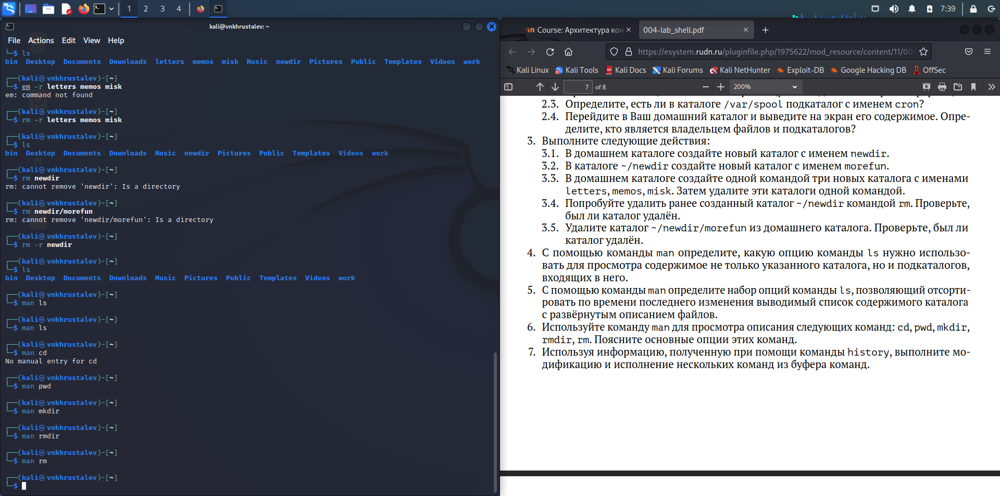
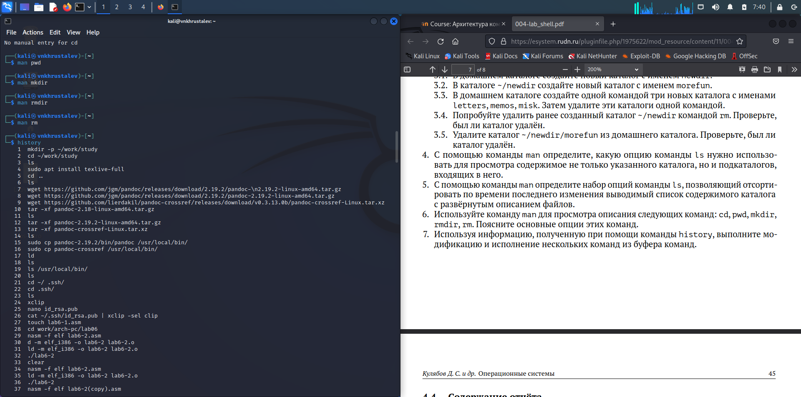
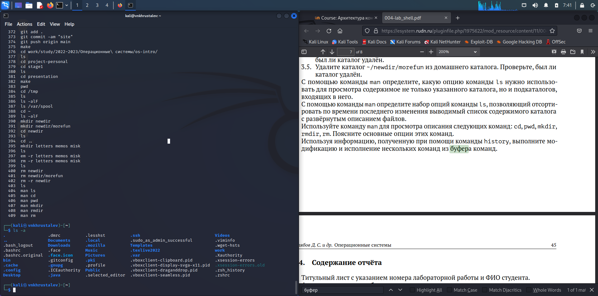

---
## Front matter
title: "Лабораторная работа 4"
subtitle: "Основы интерфейса взаимодействия пользователя с системой Unix на уровне командной строки"
author: "Хрусталев Влад Николаевич"

## Generic otions
lang: ru-RU
toc-title: "Содержание"

## Bibliography
bibliography: bib/cite.bib
csl: pandoc/csl/gost-r-7-0-5-2008-numeric.csl

## Pdf output format
toc: true # Table of contents
toc-depth: 2
lof: true # List of figures
lot: true # List of tables
fontsize: 12pt
linestretch: 1.5
papersize: a4
documentclass: scrreprt
## I18n polyglossia
polyglossia-lang:
  name: russian
  options:
	- spelling=modern
	- babelshorthands=true
polyglossia-otherlangs:
  name: english
## I18n babel
babel-lang: russian
babel-otherlangs: english
## Fonts
mainfont: PT Serif
romanfont: PT Serif
sansfont: PT Sans
monofont: PT Mono
mainfontoptions: Ligatures=TeX
romanfontoptions: Ligatures=TeX
sansfontoptions: Ligatures=TeX,Scale=MatchLowercase
monofontoptions: Scale=MatchLowercase,Scale=0.9
## Biblatex
biblatex: true
biblio-style: "gost-numeric"
biblatexoptions:
  - parentracker=true
  - backend=biber
  - hyperref=auto
  - language=auto
  - autolang=other*
  - citestyle=gost-numeric
## Pandoc-crossref LaTeX customization
figureTitle: "Рис."
tableTitle: "Таблица"
listingTitle: "Листинг"
lofTitle: "Список иллюстраций"
lotTitle: "Список таблиц"
lolTitle: "Листинги"
## Misc options
indent: true
header-includes:
  - \usepackage{indentfirst}
  - \usepackage{float} # keep figures where there are in the text
  - \floatplacement{figure}{H} # keep figures where there are in the text
---

# Цель работы

Приобретение практических навыков взаимодействия пользователя с системой посредством командной строки.

# Выполнение лабораторной работы

1. Определим командой pwd полное имя домашего каталога. У меня называется kali, а полный путь /home/kali/ (рис. @fig:001).

{#fig:001 width=70%}

2. Перейдем в каталог /tmp и выведем его содеривмое двумя командами. ls и ls -alF. Первая выводит видимые названия файлов и каталогов, а вторая вывод все файлы и каталоги, в том числе и скрытые с полной информацие о доступе, владельце и дате последнего редактирования. Так же командой ls /var/spool убедимся в наличие подкаталога в указанном каталоге с названием cron.  Далее посмотрим содержимое домашнего каталога и определим, что владельцем папок и фалов является пользователь kali (рис. @fig:002 и @fig:003 ).

{#fig:002 width=70%}

{#fig:003 width=70%}

3. Далее выполним следущие действия и где требуется пояснение предоставим его:

3.1. В домашнем каталоге создайте новый каталог с именем newdir. (рис. @fig:005 )

3.2. В каталоге ~/newdir создайте новый каталог с именем morefun. (рис. @fig:005)

3.3. В домашнем каталоге создайте одной командой три новых каталога с именами letters, memos, misk. Затем удалите эти каталоги одной командой. (рис. @fig:005 )

{#fig:005 width=70%}

3.4. Попробуйте удалить ранее созданный каталог ~/newdir командой rm. Проверьте, был ли каталог удалён. (рис. @fig:006 )

Просто командой rm удалить неможем, т.к. является директорией.

3.5. Удалите каталог ~/newdir/morefun из домашнего каталога. Проверьте, был ли каталог удалён.(рис. @fig:006 )

Тоже командой rm не удалятся. Но с ключём -r удалить можем как каталог так и всё его содержимое. Удалим весь каталог ~/newdir.

{#fig:006 width=70%}

4. Командой man выясним ключ к ls для вывода каталогов и их подкаталогов. Это команда с ключём -R(рис. @fig:007 ).

{#fig:007 width=70%}

5. Командой man выясним ключ к ls для сортровки вывода по дате редактирования с развёрнутым описанием файлов - это опции -t -l(рис. @fig:008 ).

{#fig:008 width=70%}

6. Командой man посмотрим описание команд cd pwd mkdir rmdir rm(рис. @fig:009 ).

{#fig:009 width=70%}

7. Командой history посмотрим информацию о вводимых командахрис.( @fig:010 ). Стрелками вверх и вниз выберем команду, отредактируем её и выполним. в моем члучае ls -a(рис. @fig:011 ).

{#fig:010 width=70%}

{#fig:011 width=70%}

# Контрольные вопросы

1. Что такое командная строка?

Песто работы с системой посредством команд.

2. При помощи какой команды можно определить абсолютный путь текущего каталога?

pwd. Например вот так.(рис. @fig:001 ).

{#fig:001 width=70%}

3. При помощи какой команды и каких опций можно определить только тип файлов и их имена в текущем каталоге? ls 

4. Каким образом отобразить информацию о скрытых файлах? Командой ls -a. В лабораторной было

5. При помощи каких команд можно удалить файл и каталог? Можно ли это сделать одной и той же командой? Командой rm - можно удалить файл. А командой rm -r , рекурсивной удалить и файлы и каталоги. В лабораторной примеры были

6. Каким образом можно вывести информацию о последних выполненных пользователем командах? Команда history

7. Как воспользоваться историей команд для их модифицированного выполнения? Стрелкой вверх и вниз можно листать последние команды. Примеры в лаб. работе были

8. Приведите примеры запуска нескольких команд в одной строке. apt update && apt upgrade

9. Дайте определение и приведите примера символов экранирования. Если в заданном контексте встречаются специальные символы (типа «.», «/», «*» и т.д.), надо перед ними поставить символ экранирования \ (обратный слэш). Даёт понять консоли, что обособленное \ и \ текст является одной частью.

10. Охарактеризуйте вывод информации на экран после выполнения команды ls с опцией l. Полное подробное описание содержимого в указанном каталоге

11. Что такое относительный путь к файлу? Приведите примеры использования относительного и абсолютного пути при выполнении какой-либо команды. если писать сразу название папки файла, то его никак не выделяют. Но поный путь начинается с /. Например ls work , находясь в домашенм каталоге аналогичен ls /home/user/work

12. Как получить информацию об интересующей вас команде? Команда man. Например man ls

13. Какая клавиша или комбинация клавиш служит для автоматического дополнения вводимых команд? Кнопка TAB

# Выводы

Углубленно изучили основные команды работы в командной строке
