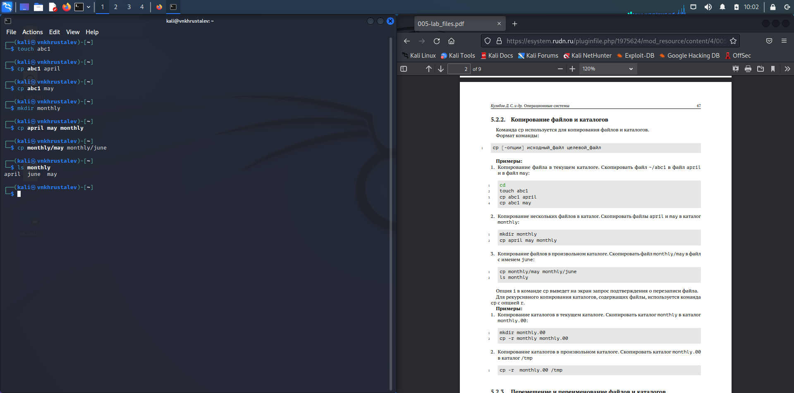
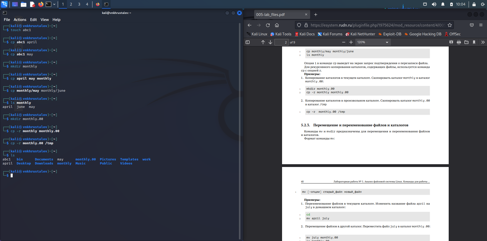
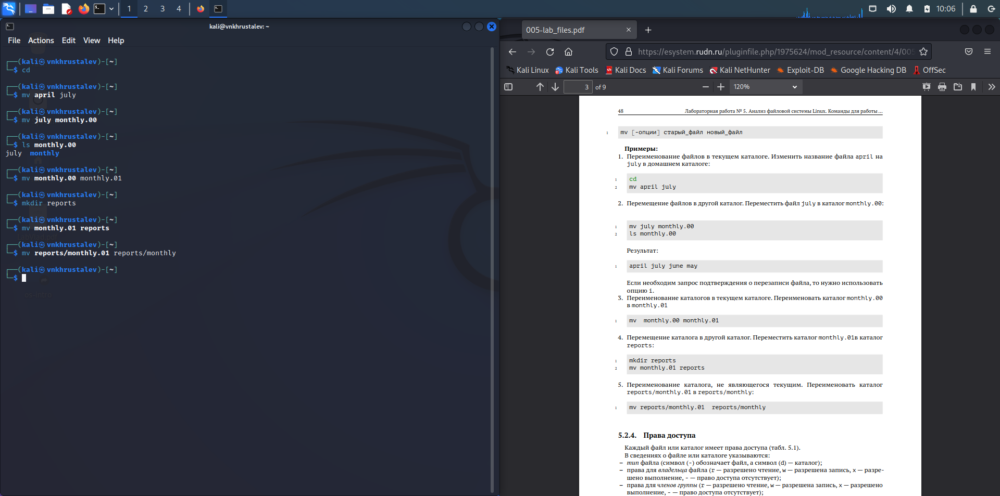
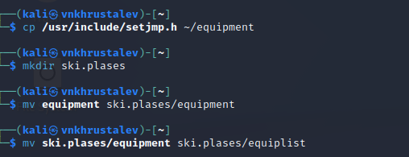
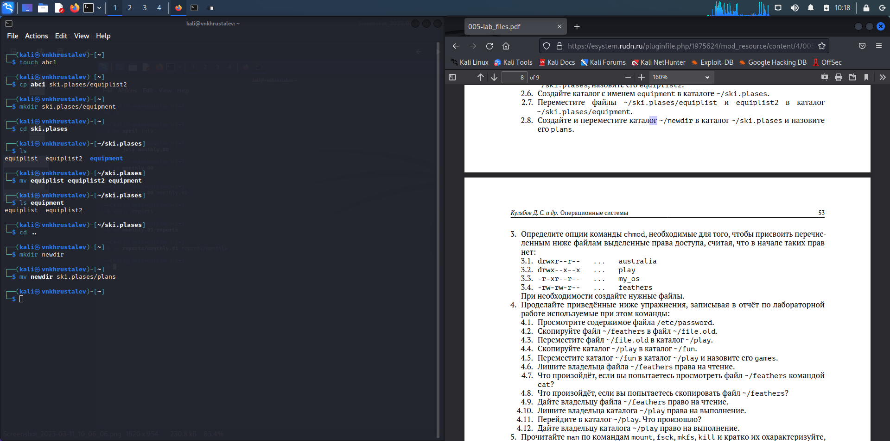
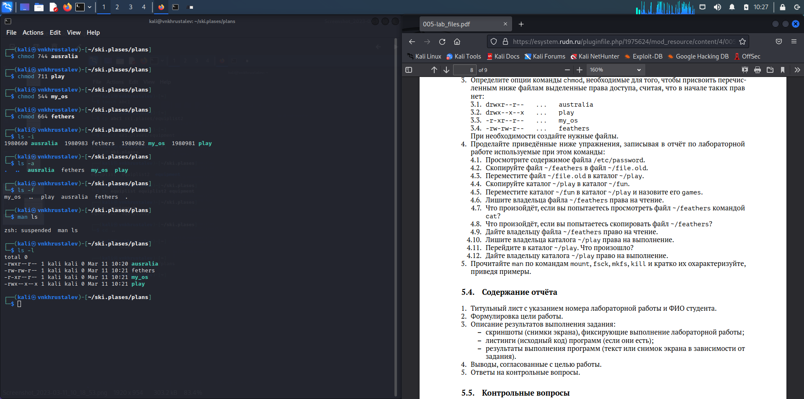
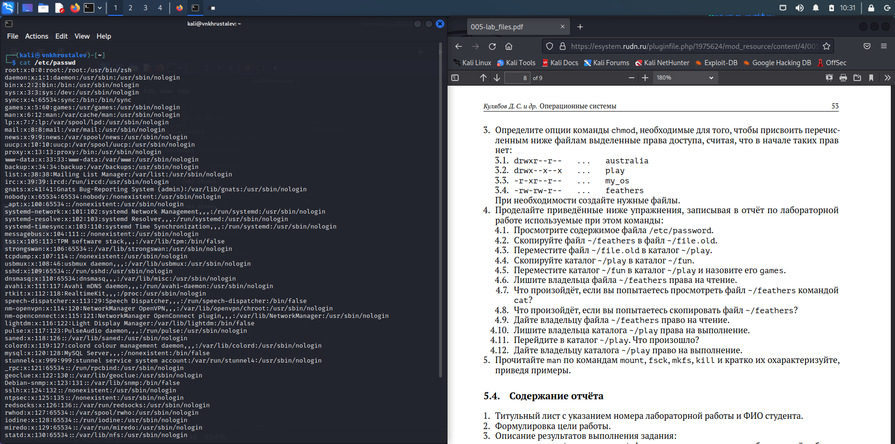
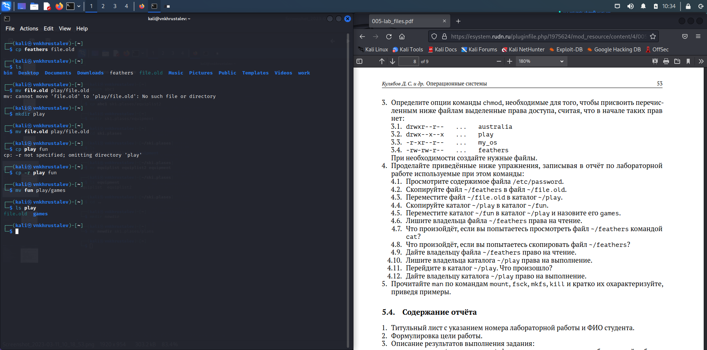
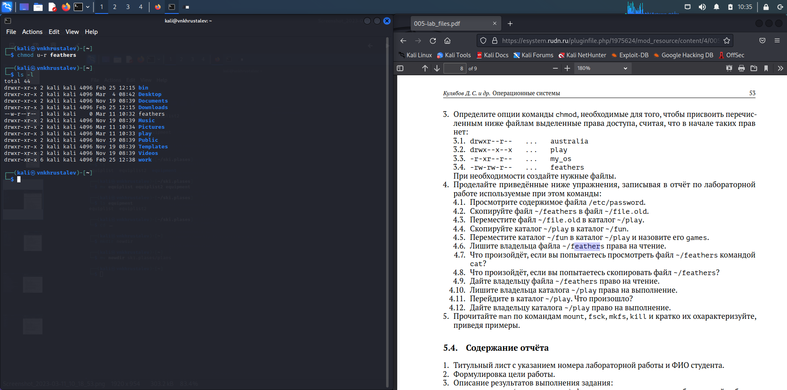
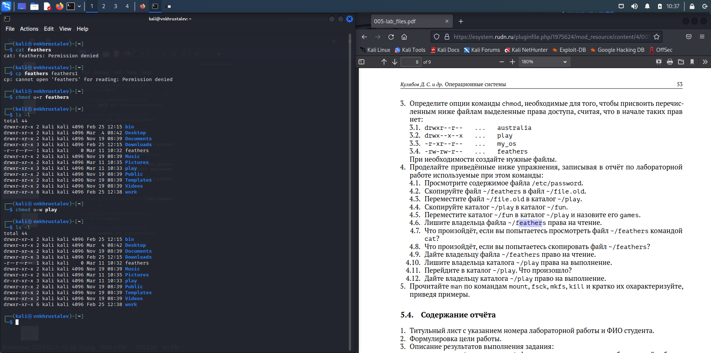

---
## Front matter
lang: ru-RU
title: презентация по лабораторной работе 5
subtitle: Markdown
author:
  - Хрусталев В.Н.
institute:
  - Российский университет дружбы народов, Москва, Россия

## i18n babel
babel-lang: russian
babel-otherlangs: english

## Formatting pdf
toc: false
toc-title: Содержание
slide_level: 2
aspectratio: 169
section-titles: true
theme: metropolis
header-includes:
 - \metroset{progressbar=frametitle,sectionpage=progressbar,numbering=fraction}
 - '\makeatletter'
 - '\beamer@ignorenonframefalse'
 - '\makeatother'
---

# Информация

## Докладчик

:::::::::::::: {.columns align=center}
::: {.column width="70%"}

  * Хрусталев Влад Николаевич
  * Студент ФМиЕН РУДН
  * Группа НПИбд-02-22

:::
::: {.column width="30%"}

:::
::::::::::::::

# Вводная часть

## Цели и задачи

- Ознакомление с файловой системой Linux, её структурой, именами и содержанием каталогов. Приобретение практических навыков по применению команд для работы с файлами и каталогами, по управлению процессами (и работами), по проверке использования диска и обслуживанию файловой системы.

## Содержание исследования

- Выполните все примеры, приведённые в первой части описания лабораторной работы.

- Работа с файлами и каталогами

- Работа с chmod

- Доп. работа с chmod

# Выполните все примеры, приведённые в первой части описания лабораторной работы.

Выполним примеры из описания команд работы. Будут только скрины, т.к. требовалось только повторить.

##

{#fig:001 width=70%}

##

{#fig:002 width=70%}

##

{#fig:003 width=70%}

# Работа с файлами и каталогами

##

Скопируем файл с переименованием. cp /usr/include/setjmp.h ~/equipment ; Далее создадим каталог mkdir ski.places ; Переместим файл equipment в ski.places, далее переименуем его. mv equipment ski.places/equipment  -> mv ski.places/equipment ski.places/equiplist

{#fig:004 width=70%}

##

Далее по заданию создадим калог equipment в ski.places. Перекинем файыл equiplist b equiplist2 в ski.places/equipment. Вся последовательность команд отображена на скриношоте.

{#fig:005 width=70%}

# Работа с chmod

##

Создадим по заданию файлы australia play my_os feathers. Выдадим права доступа, для выполнения задания, соответсвенно 744, 711, 544, 664. При проверке командой ls -l , australia и play отсутвует буква d в начале, это из-за того что у составителя лабораторной это были каталоги, а у меня файлы, как по заданию.

{#fig:006 width=70%}

# Доп. работа с chmod

##

Посмотрим содержимое файла /etc/passwd команой cat /etc/passwd

{#fig:007 width=70%}

##

Скопируйте файл ~/feathers в файл ~/file.old. -> cp feathers file.old ; Переместите файл ~/file.old в каталог ~/play. -> mv file.old play/file.old ; Скопируйте каталог ~/play в каталог ~/fun. -> cp -r play fun ; Переместите каталог ~/fun в каталог ~/play и назовите его games. -> mv fun play/games ; 

{#fig:008 width=70%}

##

Лишите владельца файла ~/feathers права на чтение. -> chmod u-r feathers ;

{#fig:009 width=70%}

##

Что произойдёт, если вы попытаетесь просмотреть файл ~/feathers командой cat? появится надпись " не достаточно разрешений". Что произойдёт, если вы попытаетесь скопировать файл ~/feathers? появится надпись " не достаточно разрешений".  Дайте владельцу файла ~/feathers право на чтение. chmod u+r feathers  

{#fig:010 width=70%}

##

Лишите владельца каталога ~/play права на выполнение. -> chmod u-x play ; Перейдите в каталог ~/play. Что произошло? надпись: " Нет разрешений".  Дайте владельцу каталога ~/play право на выполнение. -> chmod u+x play.

{#fig:011 width=70%}

# Итоги

## Вывод

- Ознакомились с файловой системой Linux и т.п. Приобрели навки работы с файловой системой в терминале.

