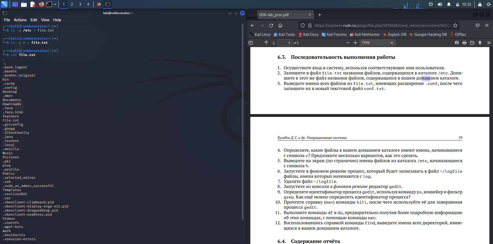
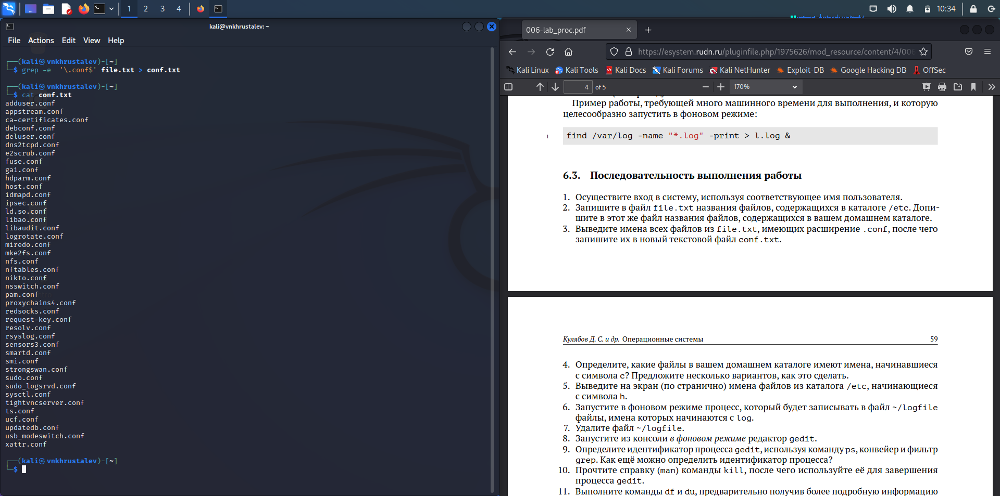
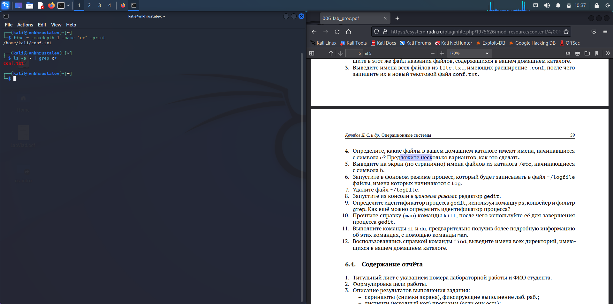
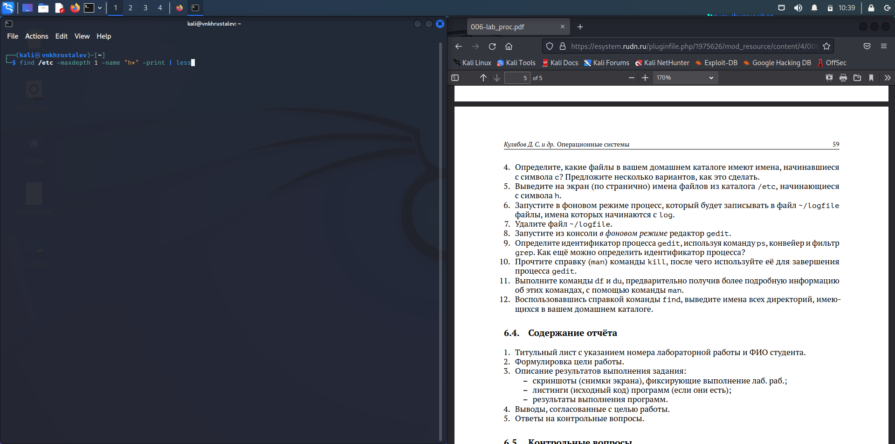
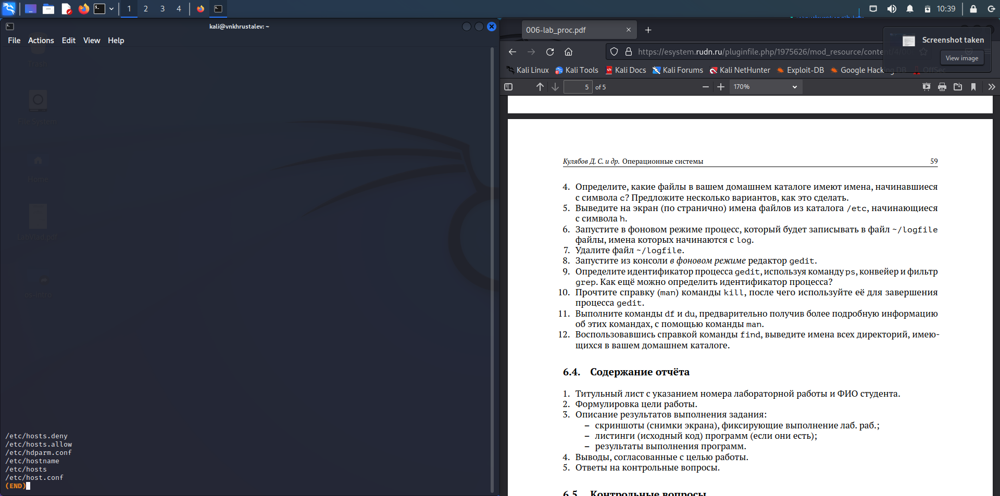
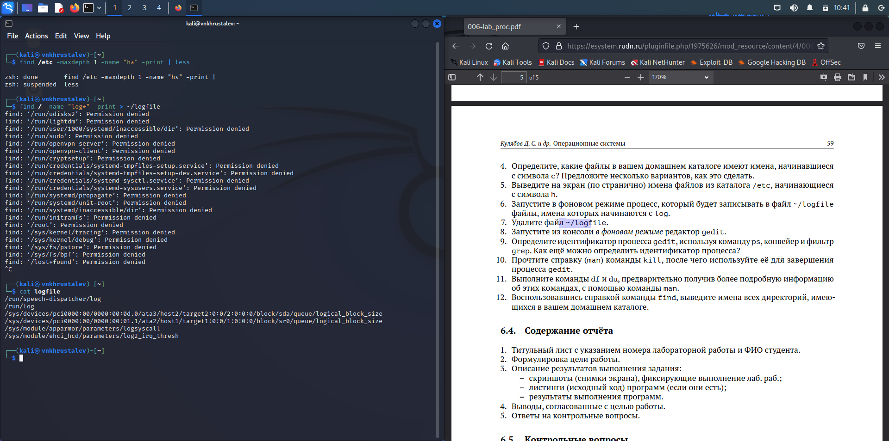
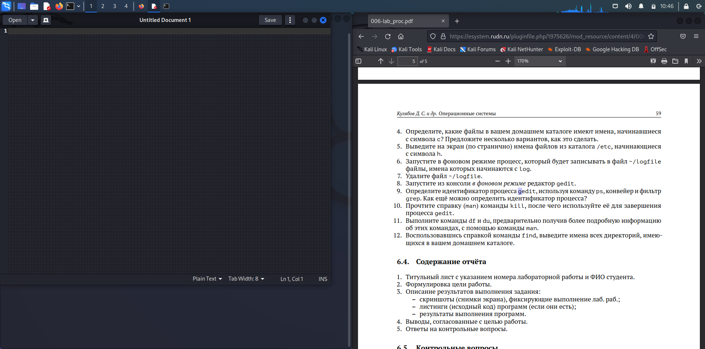
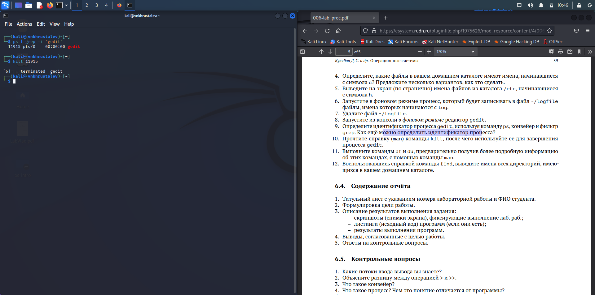
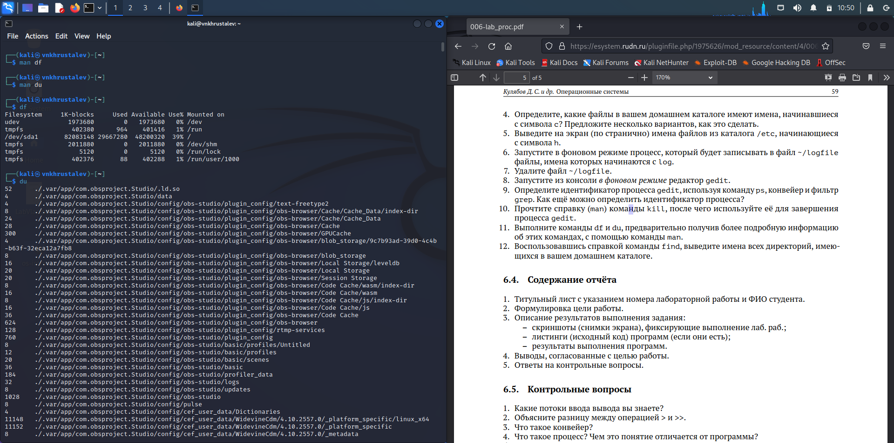
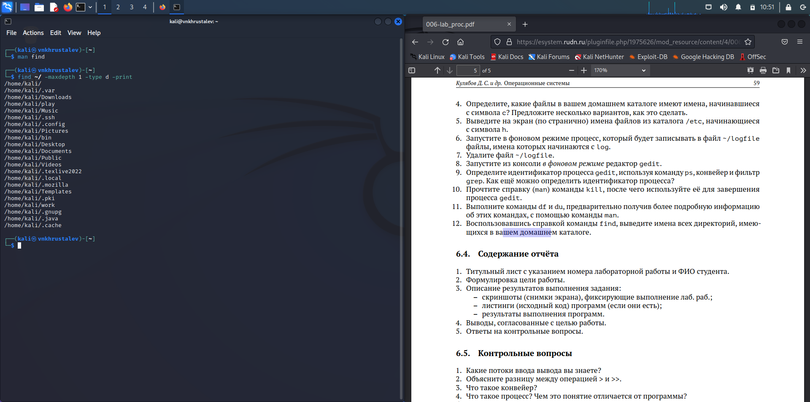

---
## Front matter
lang: ru-RU
title: презентация по лабораторной работе 6
subtitle: Markdown
author:
  - Хрусталев В.Н.
institute:
  - Российский университет дружбы народов, Москва, Россия

## i18n babel
babel-lang: russian
babel-otherlangs: english

## Formatting pdf
toc: false
toc-title: Содержание
slide_level: 2
aspectratio: 169
section-titles: true
theme: metropolis
header-includes:
 - \metroset{progressbar=frametitle,sectionpage=progressbar,numbering=fraction}
 - '\makeatletter'
 - '\beamer@ignorenonframefalse'
 - '\makeatother'
---

# Информация

## Докладчик

:::::::::::::: {.columns align=center}
::: {.column width="70%"}

  * Хрусталев Влад Николаевич
  * Студент ФМиЕН РУДН
  * Группа НПИбд-02-22

:::
::: {.column width="30%"}

:::
::::::::::::::

# Вводная часть

## Цели и задачи

- Ознакомление с инструментами поиска файлов и фильтрации текстовых данных. Приобретение практических навыков: по управлению процессами (и заданиями), по проверке использования диска и обслуживанию файловых систем.

# Выполнение работы

## Запишем в файл file.txt название файлов, содержащихся в каталоге /etc. Далее допишем в этот же файл название файлов, содержащихся в домашнем каталоге. Выполним проаерку, прочитав этот файл с помощью команды: cat

{ width=70% }

## Выведем имена всех файлов из file.txt, имеющие разширение .conf, после чего запишем их в новый текстовый файл conf.txt. Выполним проверку, прочитав новый файл.

{ width=70% }

## Определим, какие файлы в домашнем каталоге имеют имена, начинавшиеся с символа c? Приведём 2 варианта выполнение этой задачи

{ width=70% }

## Выведим на экран (по странично) имена файлов из каталога /etc, начинающиеся с символа h

{ width=70% }

{ width=70% }

## Запустим в фоновом режиме процесс, который будет записывать в файл ~/logfile файлы, имена которых начинаются с log и выполним проверку записанного в logfile

{ width=70% }

## Удалим файл ~/logfile командой rm и выполним проверку 
	
{ width=70% }

## Запустим из консоли в фоновом режиме редактор gedit.

{ width=70% }

## Определим идентификатор процесса gedit, используя команду ps, конвейер и фильтр grep

{ width=70% }

## Используем kill для завершения процесса gedit .
    	
{ width=70% }

## Выполним команды df и du, предварительно получив более подробную информацию об этих командах, с помощью команды man. 

Команда df показывает размер каждого смонтированного раздела диска.

А команда du показывает число килобайт, используемое каждым файлом или каталогом.

{ width=70% }

## Воспользовавшись справкой команды find , выведим имена всех директорий, имеющихся в домашнем каталоге.

{ width=70% }

# Итоги

## Вывод

- В ходе выполнения лабораторной работы мы ознакомились с инструментами поиска файлов и фильтрации текстовых данных. Приобрели практические навыки: по управлению процессами (и заданиями), по проверке использования диска и обслуживанию файловых систем.

