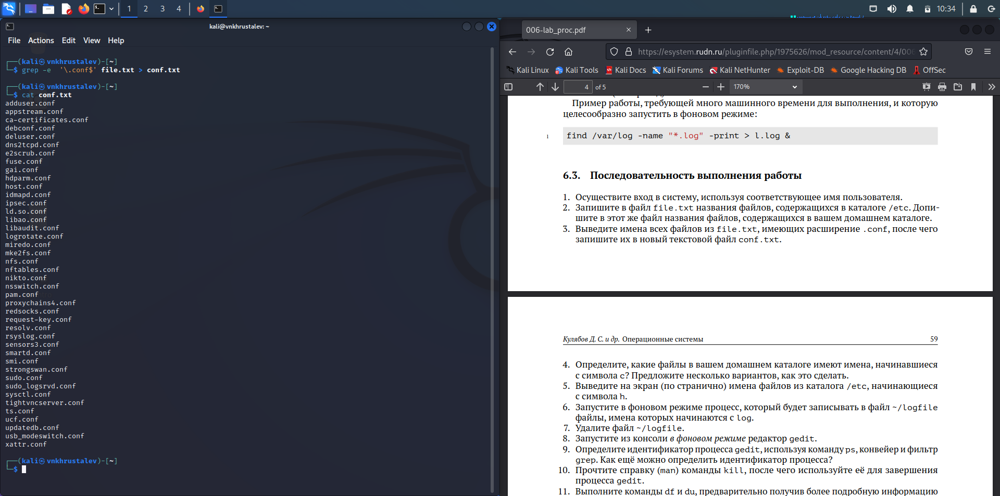
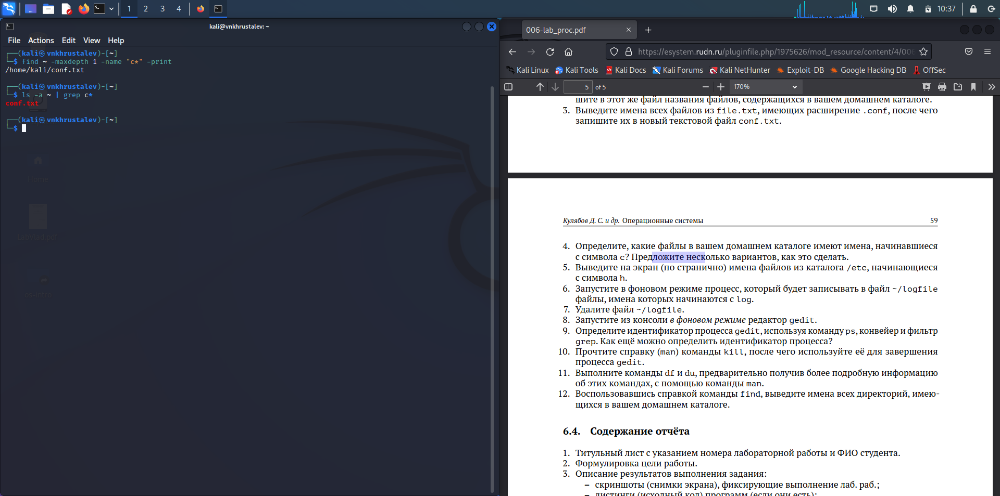
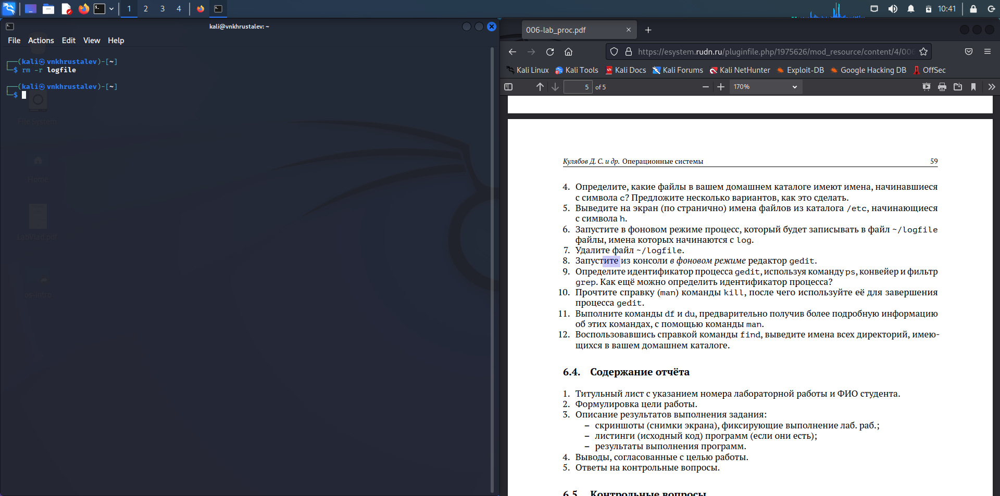
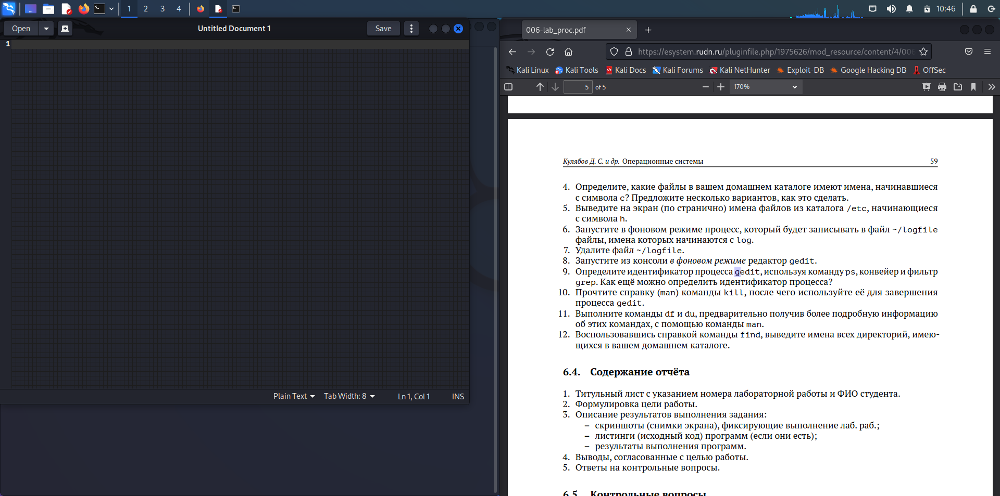
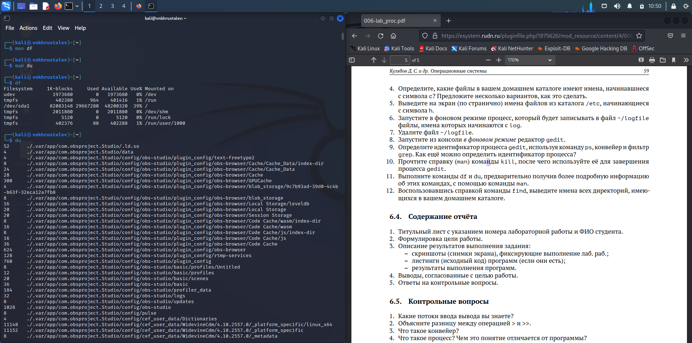

---
## Front matter
title: "Отчёт по лабораторной работе №6"
subtitle: "Поиск файлов. Перенаправление ввода-вывода. Просмотр запущенных процессов"
author: "Хрусталев Влад Николаевич"

## Generic otions
lang: ru-RU
toc-title: "Содержание"

## Bibliography
bibliography: bib/cite.bib
csl: pandoc/csl/gost-r-7-0-5-2008-numeric.csl

## Pdf output format
toc: true # Table of contents
toc-depth: 2
lof: true # List of figures
lot: true # List of tables
fontsize: 12pt
linestretch: 1.5
papersize: a4
documentclass: scrreprt
## I18n polyglossia
polyglossia-lang:
  name: russian
  options:
	- spelling=modern
	- babelshorthands=true
polyglossia-otherlangs:
  name: english
## I18n babel
babel-lang: russian
babel-otherlangs: english
## Fonts
mainfont: PT Serif
romanfont: PT Serif
sansfont: PT Sans
monofont: PT Mono
mainfontoptions: Ligatures=TeX
romanfontoptions: Ligatures=TeX
sansfontoptions: Ligatures=TeX,Scale=MatchLowercase
monofontoptions: Scale=MatchLowercase,Scale=0.9
## Biblatex
biblatex: true
biblio-style: "gost-numeric"
biblatexoptions:
  - parentracker=true
  - backend=biber
  - hyperref=auto
  - language=auto
  - autolang=other*
  - citestyle=gost-numeric
## Pandoc-crossref LaTeX customization
figureTitle: "Рис."
tableTitle: "Таблица"
listingTitle: "Листинг"
lofTitle: "Список иллюстраций"
lolTitle: "Листинги"
## Misc options
indent: true
header-includes:
  - \usepackage{indentfirst}
  - \usepackage{float} # keep figures where there are in the text
  - \floatplacement{figure}{H} # keep figures where there are in the text
---

# Цель работы

Ознакомление с инструментами поиска файлов и фильтрации текстовых данных. Приобретение практических навыков: по управлению процессами (и заданиями), по проверке использования диска и обслуживанию файловых систем.

# Выполнение лабораторной работы

Запишем в файл file.txt название файлов, содержащихся в каталоге /etc. Далее допишем в этот же файл название файлов, содержащихся в домашнем каталоге. Выполним проаерку, прочитав этот файл с помощью команды: cat (рис. [-@fig:001]).

{ #fig:001 width=70% }

Выведем имена всех файлов из file.txt, имеющие разширение .conf, после чего запишем их в новый текстовый файл conf.txt. Выполним проверку, прочитав новый файл. (рис. [-@fig:002]).

{ #fig:002 width=70% }

Определим, какие файлы в домашнем каталоге имеют имена, начинавшиеся с символа c? Приведём 2 варианта выполнение этой задачи (рис. [-@fig:003]).

{ #fig:003 width=70% }

Выведим на экран (по странично) имена файлов из каталога /etc, начинающиеся с символа h (рис. [-@fig:004]) и (рис. [-@fig:005]).

{ #fig:004 width=70% }

{ #fig:005 width=70% }

Запустим в фоновом режиме процесс, который будет записывать в файл ~/logfile файлы, имена которых начинаются с log и выполним проверку записанного в logfile(рис. [-@fig:006]).

{ #fig:006 width=70% }

Удалим файл ~/logfile командой rm и выполним проверку (рис. [-@fig:008]).
	
{ #fig:008 width=70% }

Запустим из консоли в фоновом режиме редактор gedit. (рис. [-@fig:009]).

{ #fig:009 width=70% }

Определим идентификатор процесса gedit, используя команду ps, конвейер и фильтр grep (рис. [-@fig:010]). 

{ #fig:010 width=70% }

Используем kill для завершения процесса gedit (рис. [-@fig:012]).
    	
{ #fig:012 width=70% }

Выполним команды df и du (рис. [-@fig:015]), предварительно получив более подробную информацию об этих командах, с помощью команды man. 

Команда df показывает размер каждого смонтированного раздела диска.

А команда du показывает число килобайт, используемое каждым файлом или каталогом.

{ #fig:015 width=70% }

Воспользовавшись справкой команды find , выведим имена всех директорий, имеющихся в домашнем каталоге. (рис. [-@fig:017]).

{ #fig:017 width=70% }
 
# Выводы

В ходе выполнения лабораторной работы мы ознакомились с инструментами поиска файлов и фильтрации текстовых данных. Приобрели практические навыки: по управлению процессами (и заданиями), по проверке использования диска и обслуживанию файловых систем.

# Контрольные вопросы

1. Какие потоки ввода вывода вы знаете?

Ввод и вывод распределяется между тремя стандартными потоками:
- stdin — стандартный ввод (клавиатура),
- stdout — стандартный вывод (экран),
- stderr — стандартная ошибка (вывод ошибок на экран).

2. Объясните разницу между операцией > и >>.

Основное отличие: > : Перезаписывает существующий файл или создает файл, если файл с указанным именем отсутствует в каталоге. >> : добавляет существующий файл или создает файл, если файл с указанным именем отсутствует в каталоге.

3. Что такое конвейер?

Конвейер (англ. pipeline) в терминологии операционных систем семейства Unix — некоторое множество процессов, для которых выполнено следующее перенаправление ввода-вывода: то, что выводит на поток стандартного вывода предыдущий процесс, попадает в поток стандартного ввода следующего процесса.

4. Что такое процесс? Чем это понятие отличается от программы?

Процесс - это:
- программа на стадии выполнения
- "объект", которому выделено процессорное время
- асинхронная работа 
    
5. Что такое PID и GID?

Идентификатор процесса (PID). Каждому новому процессу ядро  присваивает уникальный идентификационный номер. В любой момент времени идентификатор процесса является уникальным, хотя после завершения процесса он может использоваться снова для другого процесса. Некоторые идентификаторы зарезервированы системой для особых процессов. Так, процесс с идентификатором 1 - это процесс инициализации init, являющийся предком всех других процессов в системе.

Идентификатор группы GID и эффективный идентификатор группы (EGID) GID - это идентификационный номер группы данного процесса. EGID связан с GID также, как EUID с UID.

6. Что такое задачи и какая команда позволяет ими управлять?

Принудительное завершение процесса и изменение его приоритета) можно выполнить и без команды top. Процессы в Linux имеют возможность обмениваться так называемыми "сигналами" с ядром и другими процессами. При получении сигнала процессом, управление передается подпрограмме его обработки или ядру, если такой подпрограммы не существует. В Linux имеется команда kill, которая позволяет послать заданному процессу любой сигнал.

7. Найдите информацию об утилитах top и htop. Каковы их функции?

top - интерактивный просмотрщик процессов. htop аналог top. Программа top динамически выводит в режиме реального времени информации о работающей системе, т.е. о фактической активности процессов. По умолчанию она выдает задачи, наиболее загружающие процессор сервера, и обновляет список каждые две секунды. 

8. Назовите и дайте характеристику команде поиска файлов. Приведите примеры использования этой команды.

find : Для поиска файлов из командной строки вы можете использовать команду “find”. У этой команды следующий синтаксис:

find path criteria action
- “path” - Секция для указания директории поиска. Если ничего не указано поиск идет по текущей директории.
- “criteria” - Опции поиска.
- “action” -Опции, которые влияют на состояние поиска или контролируют его, например,
- “–print”

9. Можно ли по контексту (содержанию) найти файл? Если да, то как?

Для поиска файла по содержимому проще всего воспользоваться командой grep (вместо find).

Пример: grep -r строка_поиска каталог

10. Как определить объем свободной памяти на жёстком диске?

Самый простой способ найти свободное место на диске в Linux - это используйте команду df. Команда df означает «свободное от диска» и, очевидно, показывает вам свободное и доступное дисковое пространство в системах Linux. Работы С Нами -h вариант, он показывает дисковое пространство в удобочитаемом формате (МБ и ГБ).

11. Как определить объем вашего домашнего каталога?

В операционных системах на базе Linux посмотреть размер папки (директории) можно с помощью команды du. Эта команда, выполняемая в консоли, позволяет оценить используемый объем места на жестком диске отдельно по папкам и файлам, просуммировать результат, узнать общий размер папки.

12. Как удалить зависший процесс?

Убиваем процессы в Linux — команды ps, kill и killall

- Находим PID зависшего процесса Каждый процесс в Linux имеет свой идентификатор, называемый PID. 
- «Убиваем» процесс командой kill. Когда известен PID процесса, мы можем убить его командой kill.
- Убиваем процессы командой killall. 
- Заключение

