---
## Front matter
lang: ru-RU
title: презентация по лабораторной работе 7
subtitle: Markdown
author:
  - Хрусталев В.Н.
institute:
  - Российский университет дружбы народов, Москва, Россия

## i18n babel
babel-lang: russian
babel-otherlangs: english

## Formatting pdf
toc: false
toc-title: Содержание
slide_level: 2
aspectratio: 169
section-titles: true
theme: metropolis
header-includes:
 - \metroset{progressbar=frametitle,sectionpage=progressbar,numbering=fraction}
 - '\makeatletter'
 - '\beamer@ignorenonframefalse'
 - '\makeatother'
---

# Информация

## Докладчик

:::::::::::::: {.columns align=center}
::: {.column width="70%"}

  * Хрусталев Влад Николаевич
  * Студент ФМиЕН РУДН
  * Группа НПИбд-02-22

:::
::: {.column width="30%"}

:::
::::::::::::::

# Вводная часть

## Цели и задачи

- Освоение основных возможностей командной оболочки Midnight Commander. Приобретение навыков практической работы по просмотру каталогов и файлов; манипуляций с ними.

# Выполнение работы

# *Задание по mc*

## Изучим информацию о mc, через man mc 01

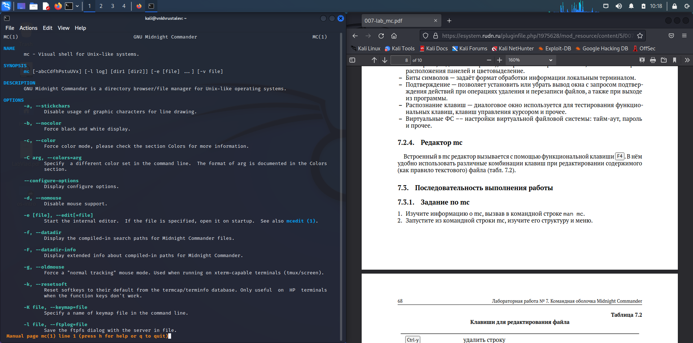{#fig:001 width=70%}

## Запустим оболочку с помощью mc и изучим структуру меню. 02

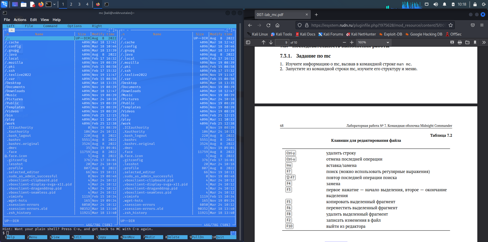{#fig:002 width=70%}

## Выполним несколько команд, используя основные управляющие клавишы 03

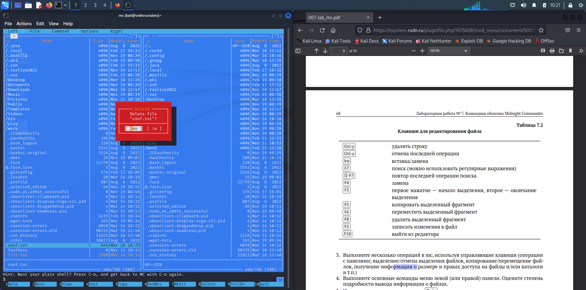{#fig:003 width=70%}

## Выполним основные команды меню левой (или правой) панели. Например, "Tree" :  04

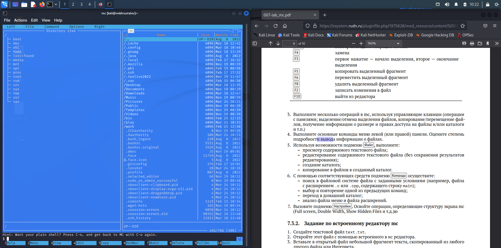{#fig:004 width=70%}

## Используя возможности подменю Файл , выполним:

## просмотр содержимого текстового файла;05

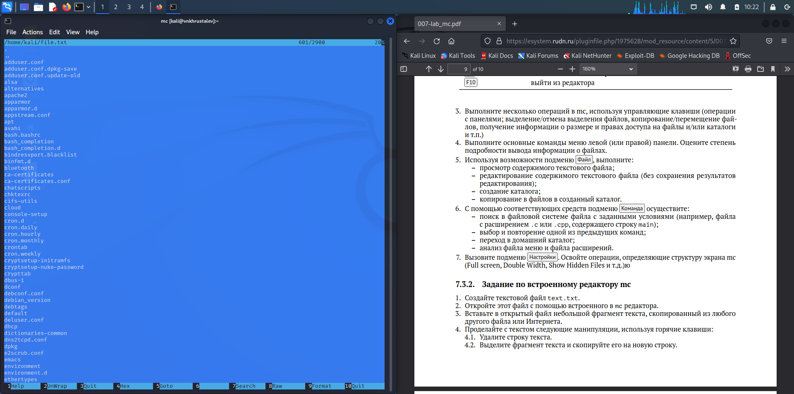{#fig:005 width=70%}
	
## создание каталога;06

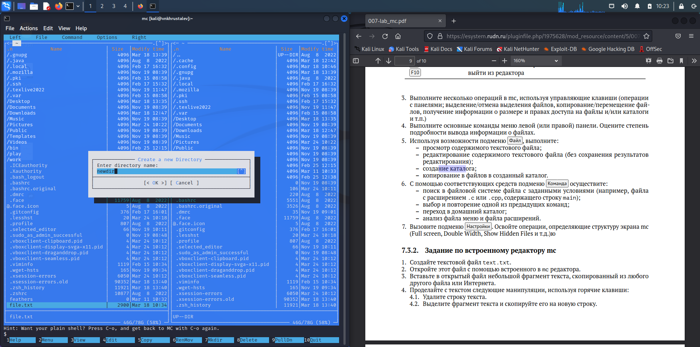{#fig:006 width=70%}
	
## копирование в файлов в созданный каталог.07

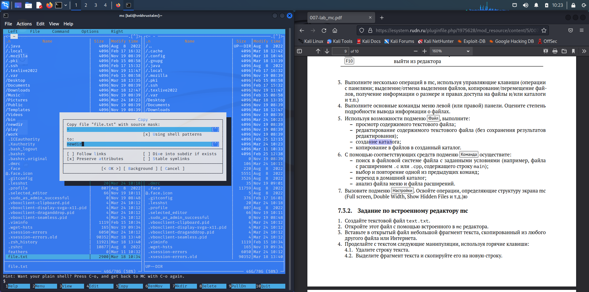{#fig:007 width=70%}
	
## С помощью соответствующих средств подменю Команда осуществим:

## поиск в файловой системе файла с заданными условиями (например, файла с расширением .c или .cpp, содержащего строку main);08

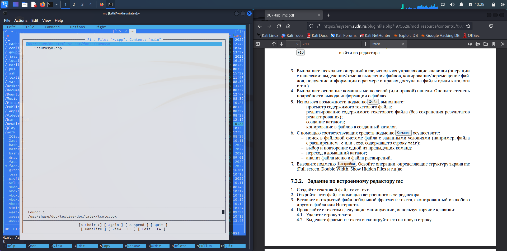{#fig:008 width=70%}
	
## выбор и повторение одной из предыдущих команд;09

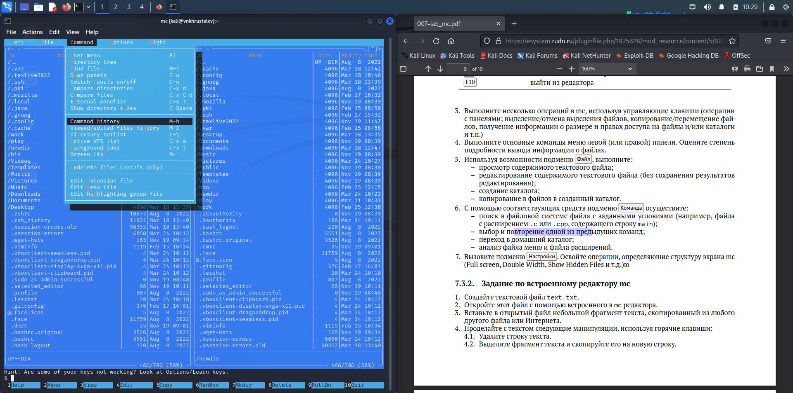{#fig:009 width=70%}
	
## переход в домашний каталог;10

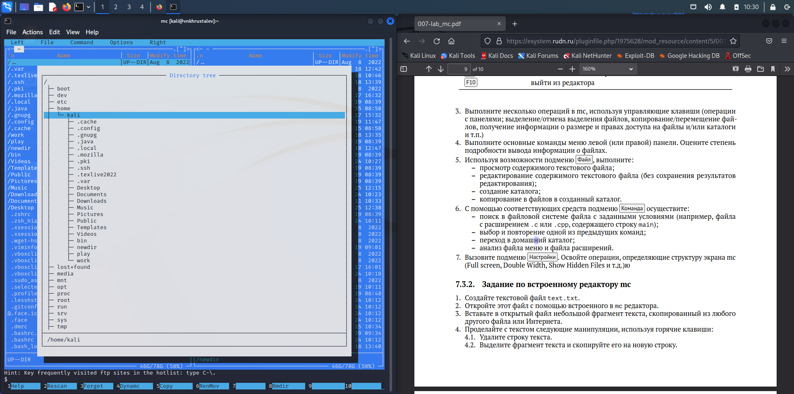{#fig:010 width=70%}
	
## анализ файла меню и файла расширений.11

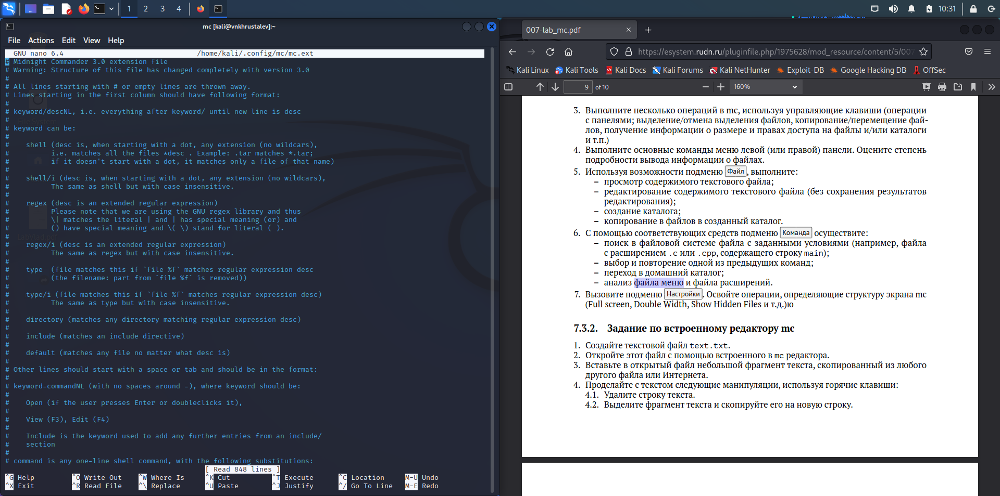{#fig:011 width=70%}
	
## Вызовем подменю Настройки и освном основные операции.12

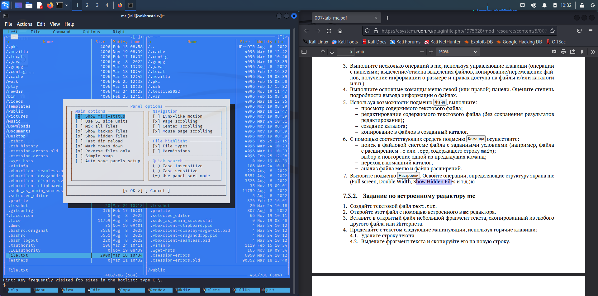{#fig:012 width=70%}

# *Задание по встроенному редактору mc*

## Создайте текстовой файл text.txt13

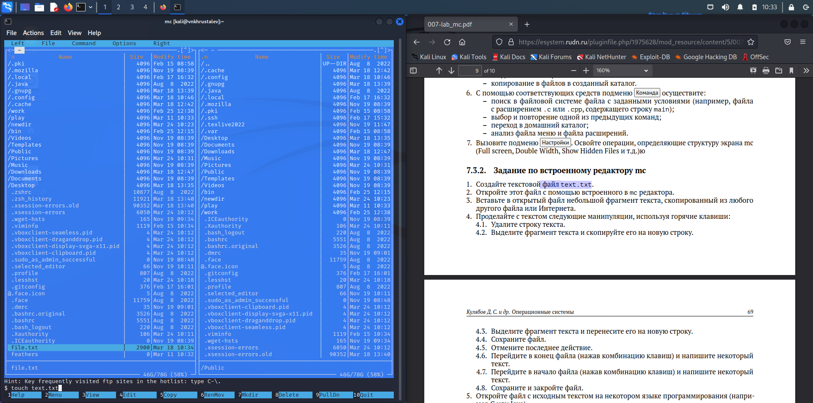{#fig:013 width=70%}

## Откройте этот файл с помощью встроенного в mc редактора14

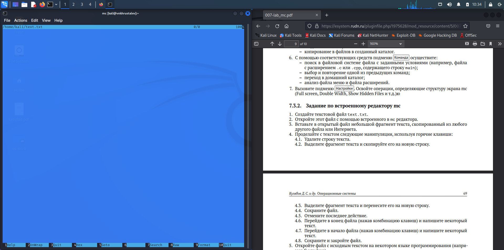{#fig:014 width=70%}

## Вставьте в открытый файл небольшой фрагмент текста15

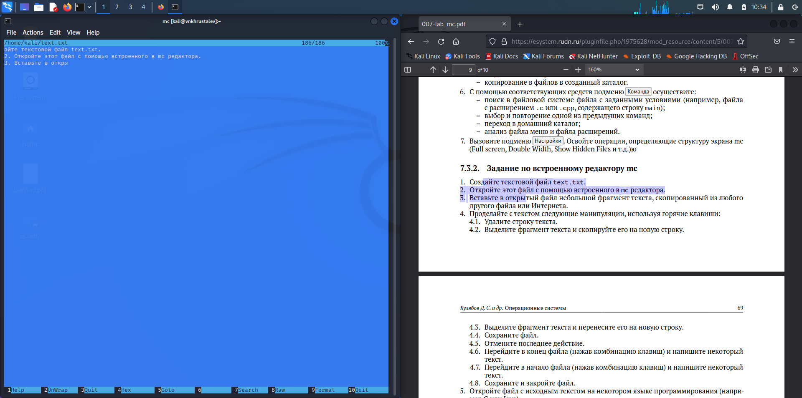{#fig:015 width=70%}

## Проделайте с текстом следующие манипуляции, используя горячие клавиши:
## Удалите строку текста.16

[Ctrl+Y](image/16.png){#fig:016 width=70%}
	
## Выделите фрагмент текста и скопируйте его на новую строку.17

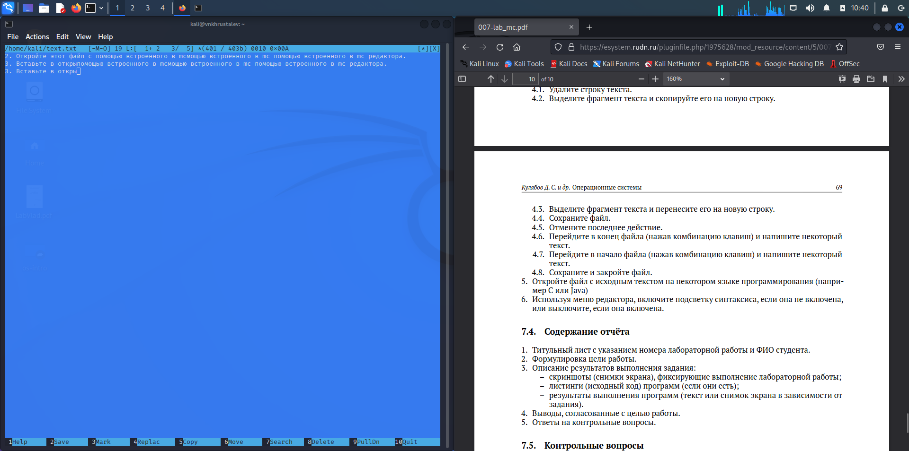{#fig:017 width=70%}
	
## Выделите фрагмент текста и перенесите его на новую строку.18

{#fig:018 width=70%}
	
## Сохраните файл.19

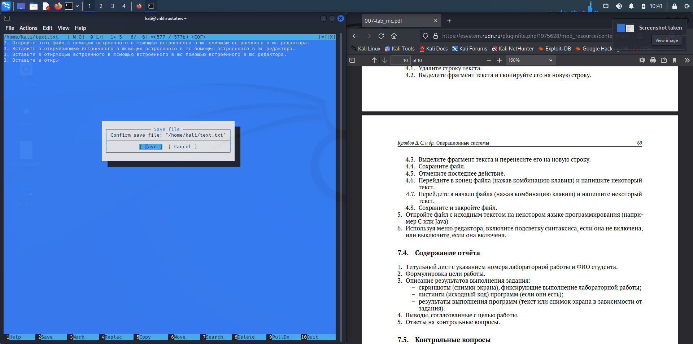{#fig:019 width=70%}
	
## Отмените последнее действие.20

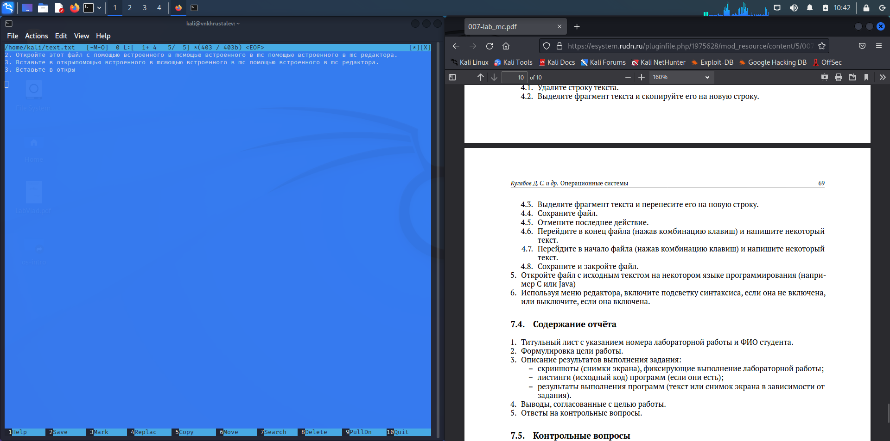{#fig:020 width=70%}
	
## Перейдите в конец файла (нажав комбинацию клавиш) и напишите некоторый текст.21

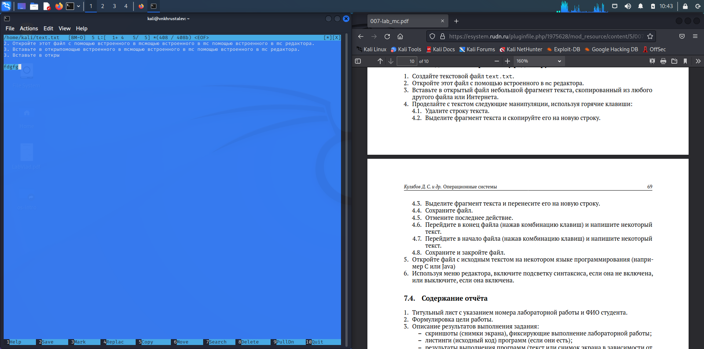{#fig:021 width=70%}
	
## Перейдите в начало файла (нажав комбинацию клавиш) и напишите некоторый текст.22

{#fig:022 width=70%}
	
## Сохраните и закройте файл
	
## Откройте файл с исходным текстом на некотором языке программирования23

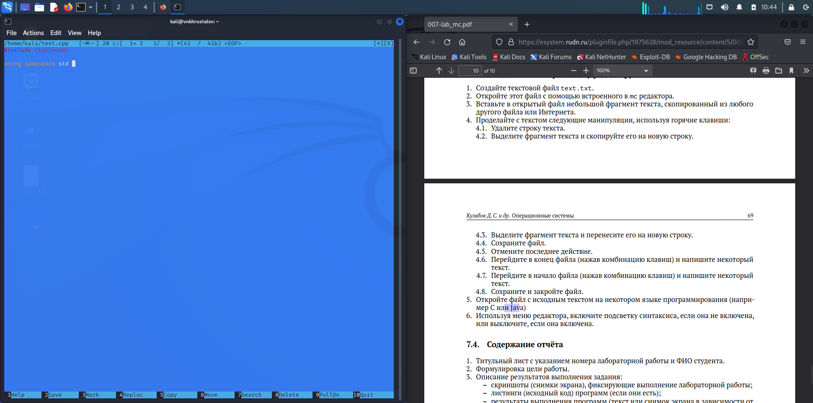{#fig:023 width=70%}

## Отлючим подсветку синтаксиса24

{#fig:024 width=70%}

# Итоги

## Вывод

- Освоили основные возможности Midnight Commander.

