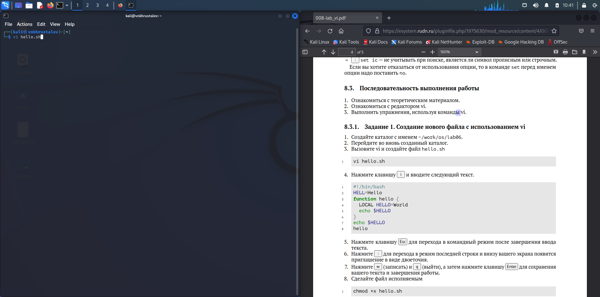
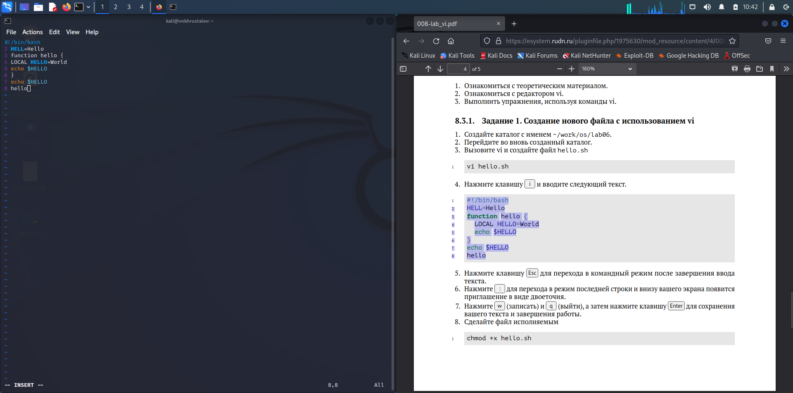
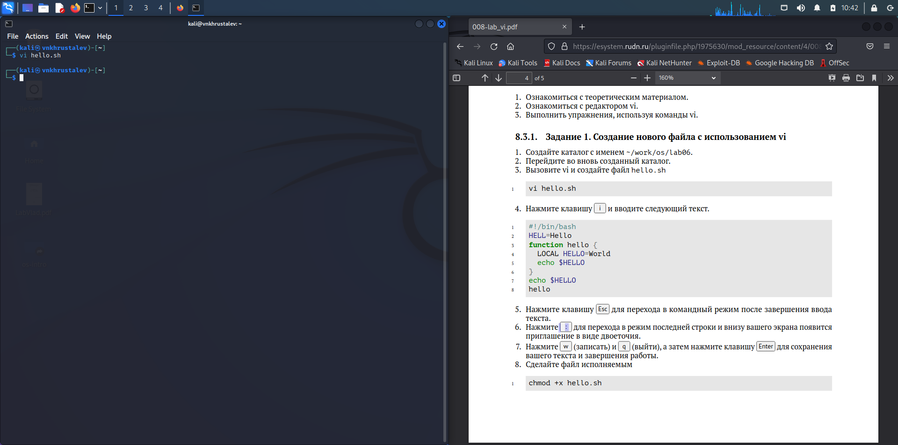
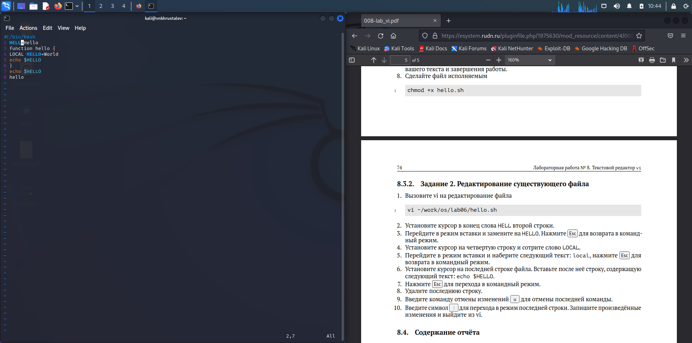
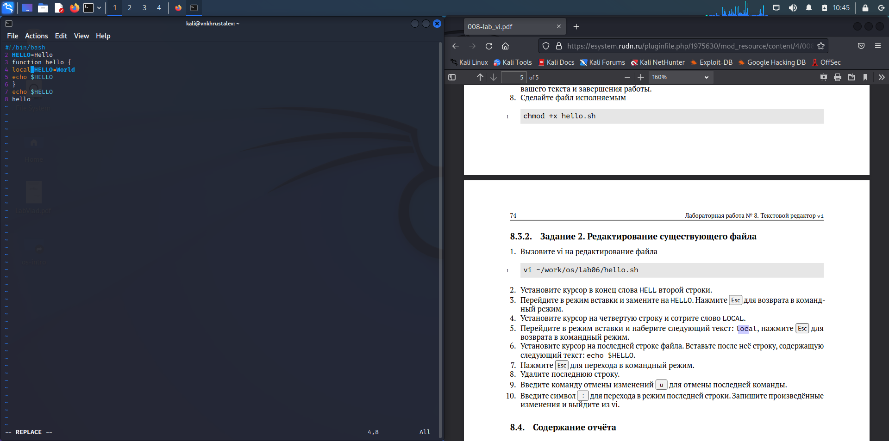
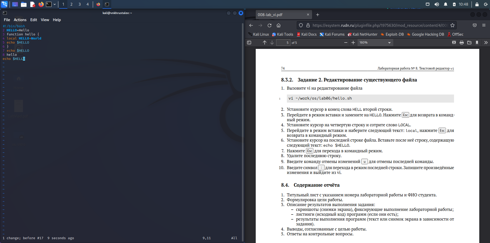

---
## Front matter
lang: ru-RU
title: презентация по лабораторной работе 8
subtitle: Markdown
author:
  - Хрусталев В.Н.
institute:
  - Российский университет дружбы народов, Москва, Россия

## i18n babel
babel-lang: russian
babel-otherlangs: english

## Formatting pdf
toc: false
toc-title: Содержание
slide_level: 2
aspectratio: 169
section-titles: true
theme: metropolis
header-includes:
 - \metroset{progressbar=frametitle,sectionpage=progressbar,numbering=fraction}
 - '\makeatletter'
 - '\beamer@ignorenonframefalse'
 - '\makeatother'
---

# Информация

## Докладчик

:::::::::::::: {.columns align=center}
::: {.column width="70%"}

  * Хрусталев Влад Николаевич
  * Студент ФМиЕН РУДН
  * Группа НПИбд-02-22

:::
::: {.column width="30%"}

:::
::::::::::::::

# Вводная часть

## Цели и задачи

- Познакомиться с операционной системой Linux. Получить практические навыки работы с редактором vi, установленным по умолчанию практически во всех дистрибутивах.

# Выполнение работы

# Задание 1

## Создадим каталог с именем ~/work/os/lab06 

## Перейдём в этот каталог

## Вызовем vi для файла hello.sh командой vi hello.sh.

## {#fig:001 width=70%}

## Нажём i и введём текст из задания.

## {#fig:002 width=70%}

## Нажмём ESC для завершения редактирования.

## {#fig:003 width=70%}

## Нажмём : для перехода в режим последней строки.

## {#fig:004 width=70%}

## ВВедём w и q , после этого нажмём Enter, чтобы сохранить изменения.

## {#fig:005 width=70%}

## Пропишем chmod +x hello.sh , чтобы сделать файл исполняемым.

# Задание 1

##Вызовем vi для редактирования файла..

{#fig:006 width=70%}

## Переёдем в режим редактирования через i и изменим слово HELL на HELLO , аналогично с LOCAL -> local . После этого нажмём ESC для прекращения изменений.

{#fig:009 width=70%}

## Допишем в конце echo $HELLO.

{#fig:010 width=70%}

## Удалим последнюю строку.

{#fig:011 width=70%}

## Теперь кнопкной u мы можем отменять изменения, сделаем это.

{#fig:012 width=70%}

## Сохраним документ, как в последнем пункте прошлого задания.

{#fig:013 width=70%}

# Итоги

## Вывод

- Получили практические навыки паботы с редактором vi.

