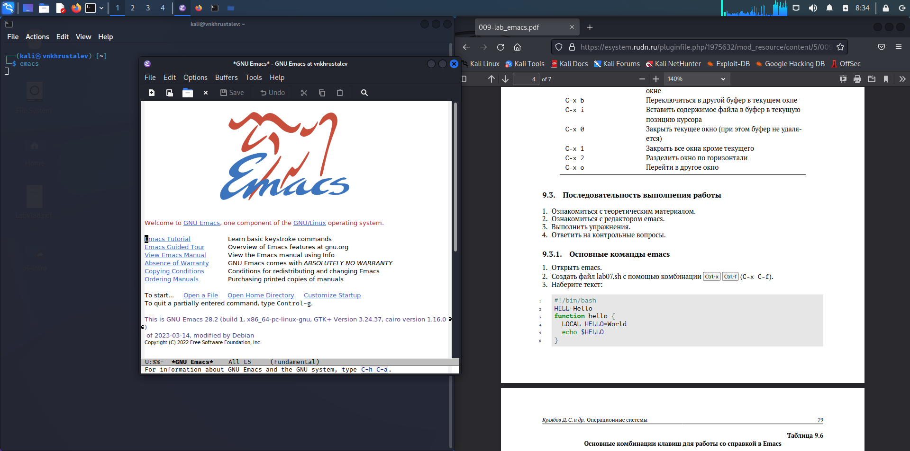

---
## Front matter
lang: ru-RU
title: презентация по лабораторной работе 9
subtitle: Markdown
author:
  - Хрусталев В.Н.
institute:
  - Российский университет дружбы народов, Москва, Россия

## i18n babel
babel-lang: russian
babel-otherlangs: english

## Formatting pdf
toc: false
toc-title: Содержание
slide_level: 2
aspectratio: 169
section-titles: true
theme: metropolis
header-includes:
 - \metroset{progressbar=frametitle,sectionpage=progressbar,numbering=fraction}
 - '\makeatletter'
 - '\beamer@ignorenonframefalse'
 - '\makeatother'
---

# Информация

## Докладчик

:::::::::::::: {.columns align=center}
::: {.column width="70%"}

  * Хрусталев Влад Николаевич
  * Студент ФМиЕН РУДН
  * Группа НПИбд-02-22

:::
::: {.column width="30%"}

:::
::::::::::::::

# Вводная часть

## Цели и задачи

- Познакомиться с операционной системой Linux. Получить практические навыки работы с редактором Emacs.

# Выполнение работы

## Установим и запустим emacs

{#fig:001 width=70%}

## Сочетанием клавич C-x C-f создадим файл lab07.sh

{#fig:002 width=70%}

## Введём текст из задания.

{#fig:003 width=70%}

## Сохраним файл и выполним последовательность действий через сочентания клавиш(пункт 5)

{#fig:004 width=70%}

## Аналогично сочетаниями клавиш научимся перемещать курсок (Пункт 6)

## Перейдём к управлению буферами, сочетаниями C-X C-b выведем список активных буферов на экран  

{#fig:005 width=70%}

## Пункт 8 - управление окнами, нажатиями С-x 3 , C-x 2 продублируем экран, чтобы в итоге было 4е части.

{#fig:006 width=70%}

## В каждом окне откроем новый файл

{#fig:007 width=70%} 

## Ну и 9ый пункт - режим поиска. C-s нажатиями начнём поиск по тексту, например, найдём echo 

{#fig:008 width=70%} 

# Итоги

## Вывод

- Получил практические навыки работы с Emacs.

