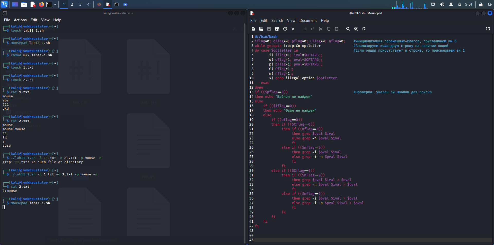
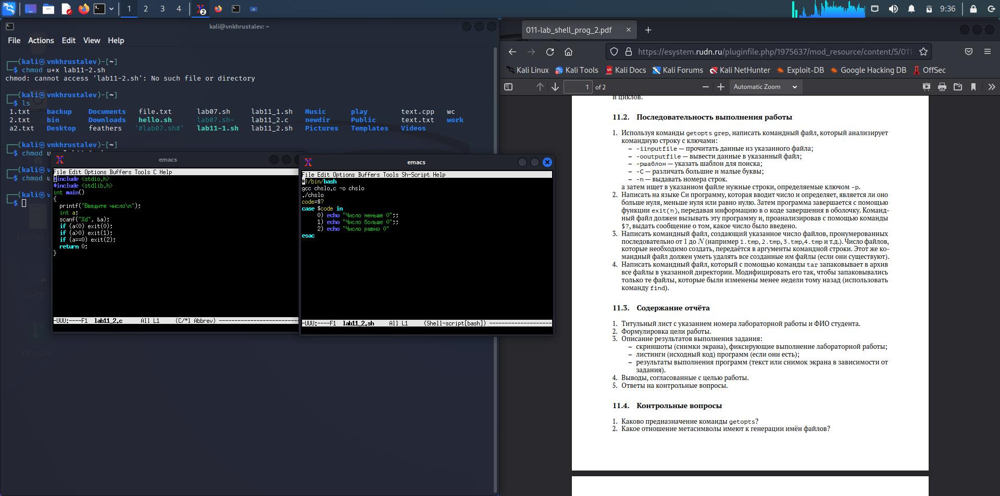
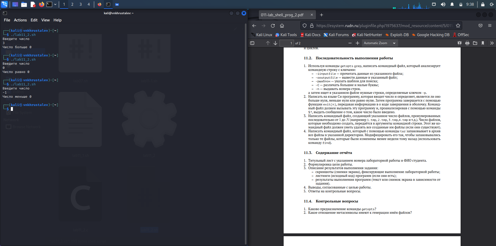
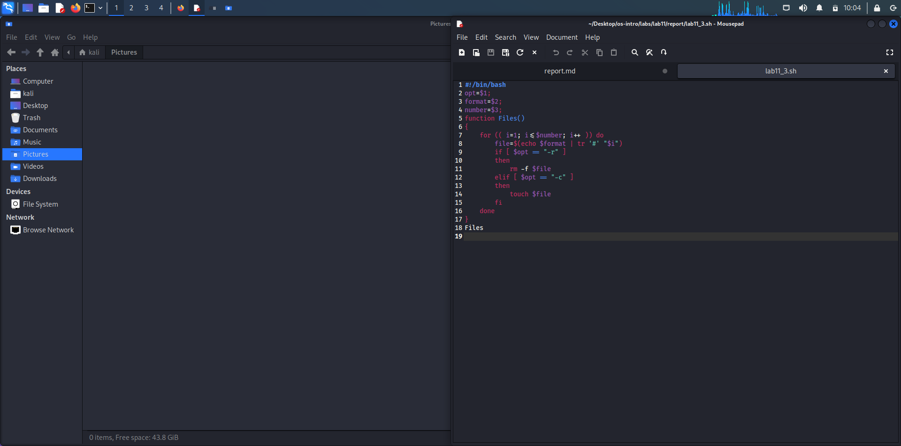
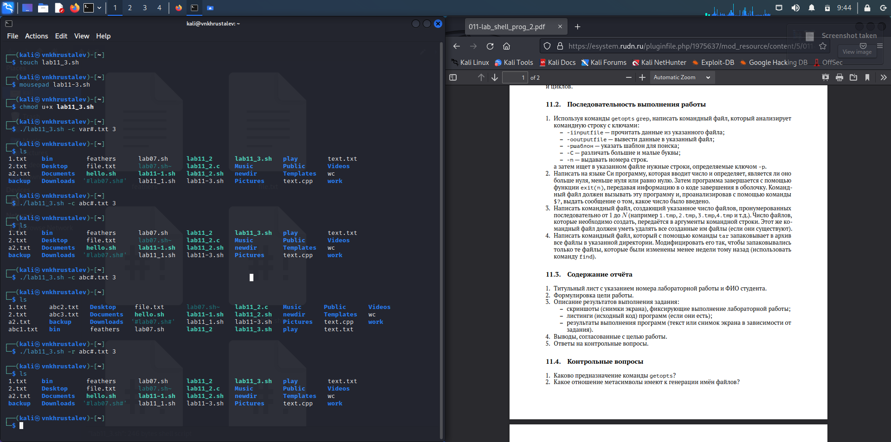
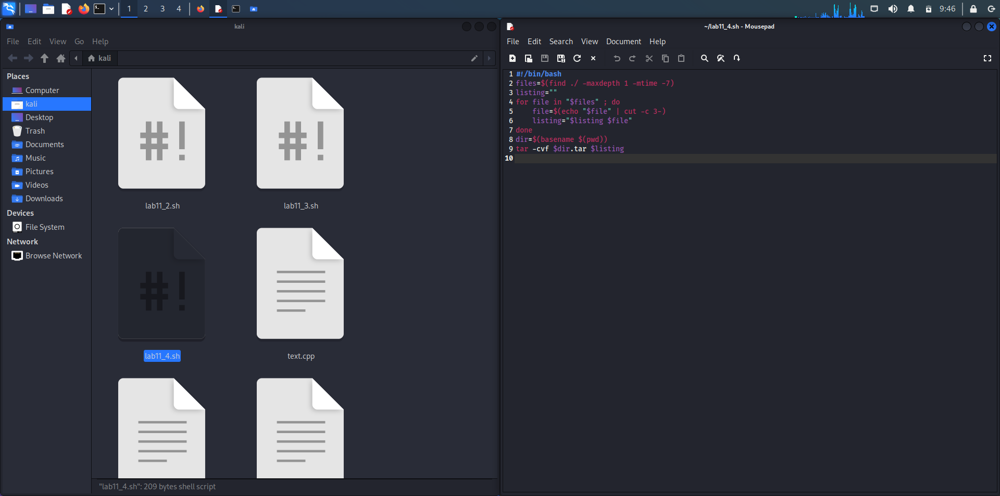
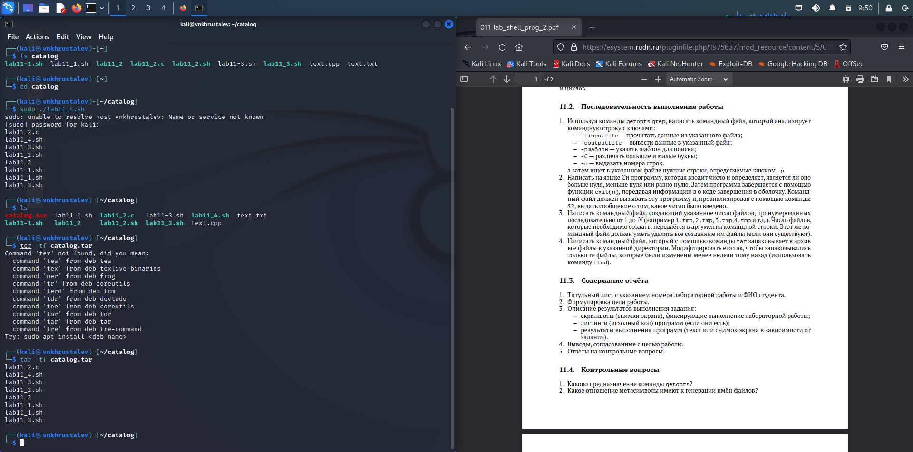

---
## Front matter
lang: ru-RU
title: презентация по лабораторной работе 11
subtitle: Markdown
author:
  - Хрусталев В.Н.
institute:
  - Российский университет дружбы народов, Москва, Россия

## i18n babel
babel-lang: russian
babel-otherlangs: english

## Formatting pdf
toc: false
toc-title: Содержание
slide_level: 2
aspectratio: 169
section-titles: true
theme: metropolis
header-includes:
 - \metroset{progressbar=frametitle,sectionpage=progressbar,numbering=fraction}
 - '\makeatletter'
 - '\beamer@ignorenonframefalse'
 - '\makeatother'
---

# Информация

## Докладчик

:::::::::::::: {.columns align=center}
::: {.column width="70%"}

  * Хрусталев Влад Николаевич
  * Студент ФМиЕН РУДН
  * Группа НПИбд-02-22

:::
::: {.column width="30%"}

:::
::::::::::::::

# Вводная часть

## Цели и задачи

- Изучить основы программирования в оболочке ОС UNIX. Научится писать более сложные командные файлы с использованием логических управляющих конструкций и циклов.

# Выполнение работы

## Создадим файл, пропишем код в соответсвии с заданием, дадим разрешение на выполнение и проверим работу предварительно создав два файла с текстом.

{#fig:001 width=70%}

## Повторим аналогичные дейсвия для последующим програамм. И создадим уже два файла взаимосвязанных для второго задания.

{#fig:002 width=70%}

## Проверим работу готовой связки программ 2.

{#fig:003 width=70%}

## Напишем программу 3.

{#fig:100 width=70%}

## Проверим её работу, создав пару файлов.

{#fig:004 width=70%}

## И для 4ой программы аналогично напишем код.

{#fig:005 width=70%}

## Из задания придумаем тест для программы. Создадим ковый каталог, закинем в него пару файлов, в том числе и lab11-4.sh .  Запустим программму, должен создаться tar  файл. Проверим его содержание.

{#fig:006 width=70%}

# Итоги

## Вывод

- Научились писать более менее сложные командные файлы с использованием логических управляющих конструкций и циклов.

