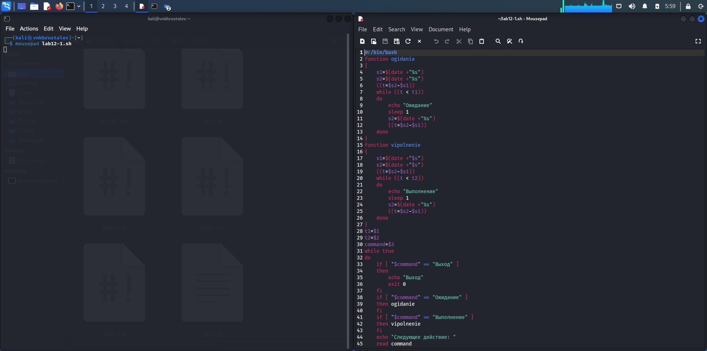
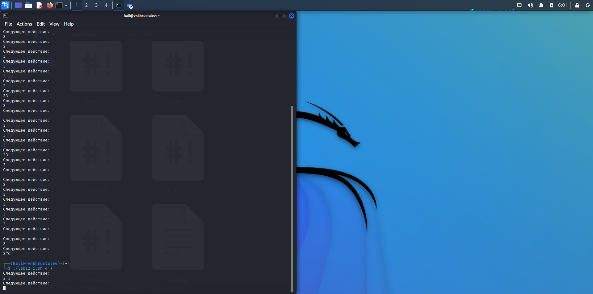
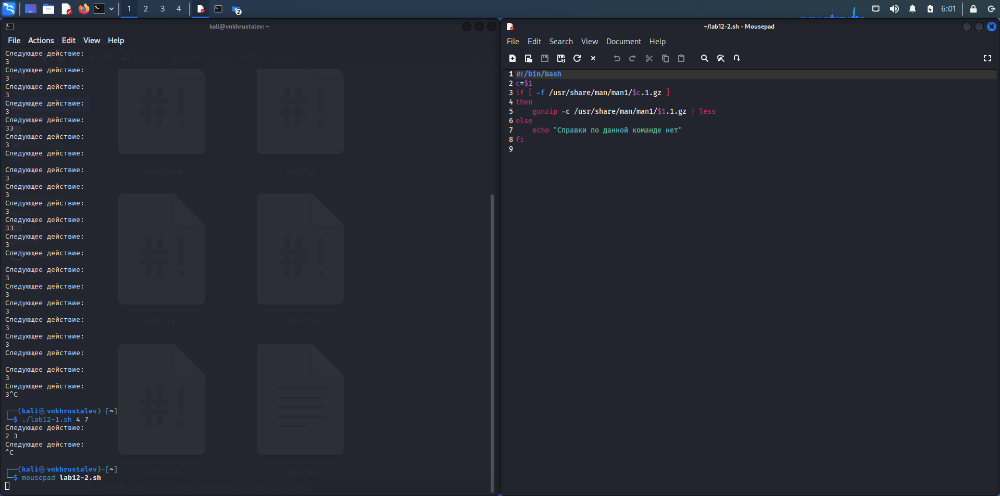
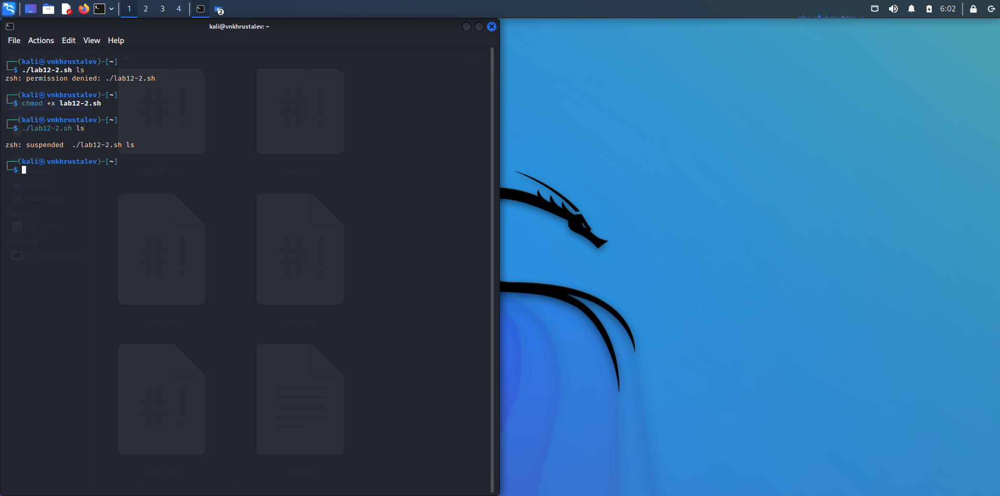
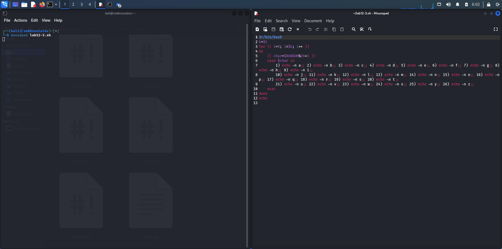
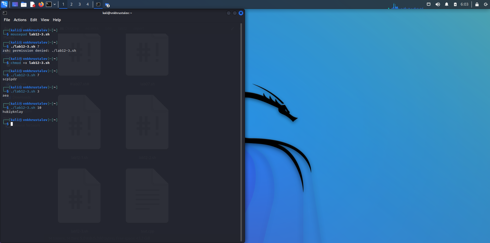

---
## Front matter
lang: ru-RU
title: презентация по лабораторной работе 12
subtitle: Markdown
author:
  - Хрусталев В.Н.
institute:
  - Российский университет дружбы народов, Москва, Россия

## i18n babel
babel-lang: russian
babel-otherlangs: english

## Formatting pdf
toc: false
toc-title: Содержание
slide_level: 2
aspectratio: 169
section-titles: true
theme: metropolis
header-includes:
 - \metroset{progressbar=frametitle,sectionpage=progressbar,numbering=fraction}
 - '\makeatletter'
 - '\beamer@ignorenonframefalse'
 - '\makeatother'
---

# Информация

## Докладчик

:::::::::::::: {.columns align=center}
::: {.column width="70%"}

  * Хрусталев Влад Николаевич
  * Студент ФМиЕН РУДН
  * Группа НПИбд-02-22

:::
::: {.column width="30%"}

:::
::::::::::::::

# Вводная часть

## Цели и задачи

- Изучить основы программирования в оболочке ОС UNIX. Научиться писать более сложные командные файлы с использованием логических управляющих конструкций и циклов.

# Выполнение работы

## Откроем терминал и создадим в домашнем каталоге файл sem.sh. После чего перейдём emacs .

## В emacs откроем созданный файл lab11-1.sh и приступим к написанию командного файла, который реализует упрощённый механизм семафоров. Командный файл должен в течение некоторого времени t1 дожидаться освобождения ресурса, выдавая об этом сообщение, а дождавшись его освобождения, использовать его в течение некоторого времени t2<>t1, также выдавая информацию о том, что ресурс используется соответствующим командным файлом (процессом). Запустить командный файл в одном виртуальном терминале в фоновом режиме, перенаправив его вывод в другой (> /dev/tty#, где # — номер терминала куда перенаправляется вывод), в котором также запущен этот файл, но не фоновом, а в привилегированном режиме..

{ #fig:001 width=100% }

## После того как скрипт написан мы сохраняем файл и закрываем emacs. В терминале мы даём этому файлу право на выполнение и запускаем его . Сохраняем файл и проверяем его работу 

{ #fig:002 width=100% }

## В домашнем каталоге создаём файл lab11-2.sh, но уже для второго задания. Запускаем emacs. Приступаем к реализации команды man с помощью командного файла. Изучим содержимое каталога /usr/share/man/man1. В нем находятся архивы текстовых файлов, содержащих справку по большинству установленных в системе программ и команд. Каждый архив можно открыть командой less сразу же просмотрев содержимое справки. Командный файл должен получать в виде аргумента командной строки название команды и в виде результата выдавать справку об этой команде или сообщение об отсутствии справки, если соответствующего файла нет в каталоге man1 .

{ #fig:003 width=100% }

## Сохраняем файл и даём в терминале право на выполнение. Запускаем файл man.sh для команды ls .

{ #fig:004 width=100% }

## После открытия файла lab12-3.sh напишем командный файл, генерирующий случайную последовательность букв латинского алфавита. Учтём, что $RANDOM выдаёт псевдослучайные числа в диапазоне от 0 до 32767. .
	
{ #fig:005 width=100% }

## Сохраняем наш скрипт и даём право на выполнение. Запускаем файл для трёх разных чисел . 

{ #fig:006 width=100% }

# Итоги

## Вывод

- В ходе выполнения лабораторной работы мы изучили основы программирования в оболочке ОС UNIX и научились писать более сложные командные файлы с использованием логических управляющих конструкций и циклов.

