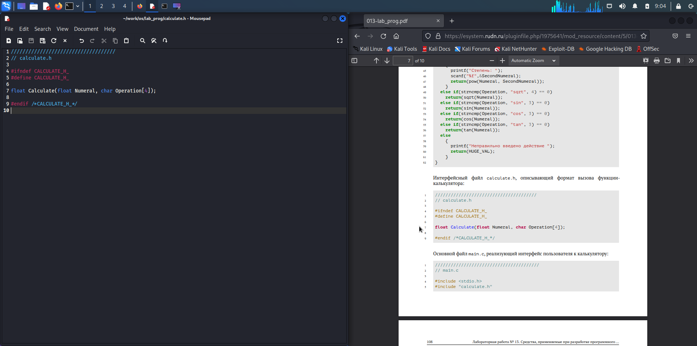

---
## Front matter
lang: ru-RU
title: презентация по лабораторной работе 13
subtitle: Markdown
author:
  - Хрусталев В.Н.
institute:
  - Российский университет дружбы народов, Москва, Россия

## i18n babel
babel-lang: russian
babel-otherlangs: english

## Formatting pdf
toc: false
toc-title: Содержание
slide_level: 2
aspectratio: 169
section-titles: true
theme: metropolis
header-includes:
 - \metroset{progressbar=frametitle,sectionpage=progressbar,numbering=fraction}
 - '\makeatletter'
 - '\beamer@ignorenonframefalse'
 - '\makeatother'
---

# Информация

## Докладчик

:::::::::::::: {.columns align=center}
::: {.column width="70%"}

  * Хрусталев Влад Николаевич
  * Студент ФМиЕН РУДН
  * Группа НПИбд-02-22

:::
::: {.column width="30%"}

:::
::::::::::::::

# Вводная часть

## Цели и задачи

- Приобрести простейшие навыки разработки, анализа, тестирования и отладки приложений в ОС типа UNIX/Linux на примере создания на языке программирования С калькулятора с простейшими функциями.

# Выполнение работы

## В домашнем каталоге создадим подкаталог ~/work/os/lab_prog. После чего создадим в нём файлы: calculate.h, calculate.c, main.c и выполним проверку. Перейдём в mousepad.

{ #fig:001 width=100% }

## В mousepad откроем созданный файл calculate.c и приступим к переносу в него скрипта из файла

{ #fig:002 width=100% }

## После того как мы перенесли и сохранили скрипт для первого файла, открываем файл calculate.h и также переносим в него скрипт, но уже для второго файла. Выполняем сохранение

{ #fig:003 width=100% }

## Теперь нам нужно перенести последний третий скрипт в файл main.c. После чего также выполняем сохранение и закрываем emacs

{ #fig:004 width=100% }

## В терминале выполним компиляцию программы посредством gcc

{ #fig:005 width=100% }

## Создадим Makefile и внесём туда небольшие изменения. В переменную CFLAGS добавил опцию -g, необходимую для компиляции объектных файлов и их использования в программе отладчика GDB. Сделал так, что утилита компиляции выбирается с помощью переменной CC

{ #fig:006 width=100% }

## С помощью gdb выполним отладку программы calcul. После чего запустим программу командой run 

{ #fig:007 width=100% }

## Воспользовавшись утилитой splint проанализируем коды файлов calculate.c и main.c. C помощью утилиты splint выяснилось, что в файлах calculate.c и main.c присутствует функция чтения scanf, возвращающая целое число (тип int), но эти числа не используются и нигде не сохранятся. Утилита вывела предупреждение о том, что в файле calculate.c происходит сравнение вещественного числа с нулем. Также возвращаемые значения (тип double) в функциях pow, sqrt, sin, cos и tan записываются в переменную типа float, что свидетельствует о потери данных

{ #fig:008 width=100% }

{ #fig:009 width=100% }

# Итоги

## Вывод

- В ходе выполнения лабораторной работы мы приобрели простейшие навыки разработки, анализа, тестирования и отладки приложений в ОС типа UNIX/Linux на примере создания на языке программирования С калькулятора с простейшими функциями

