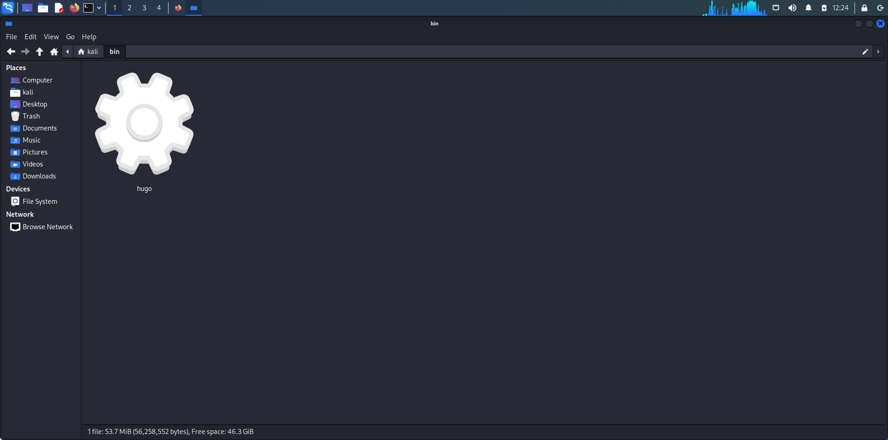
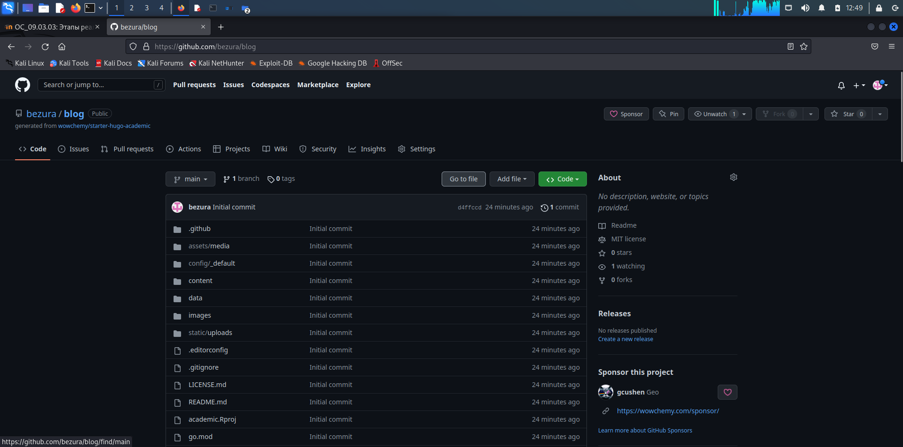
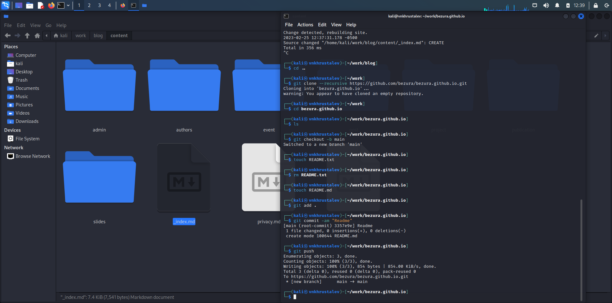
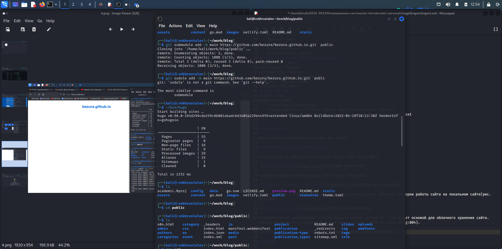
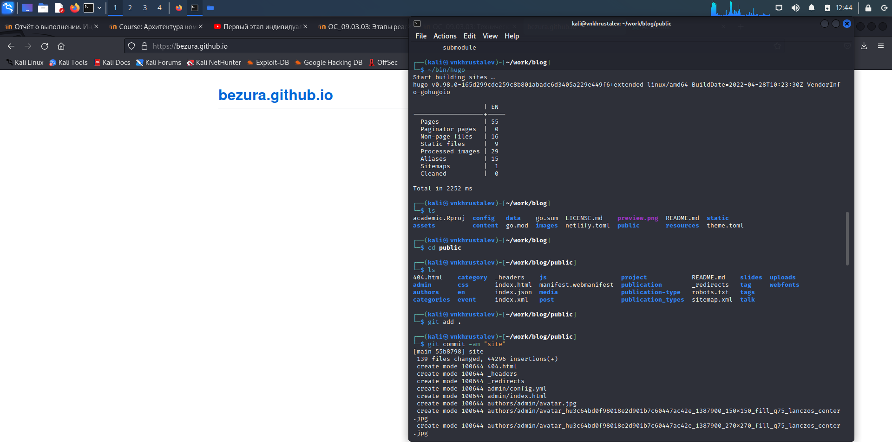
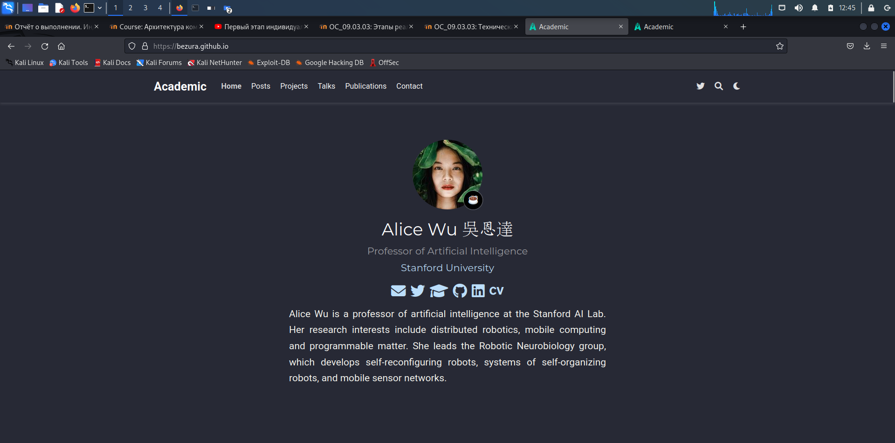

---
## Front matter
lang: ru-RU
title: Этап 1 по ИП
subtitle: Размещение на Github pages заготовки для персонального сайта
author:
  - Хрусталев В.Н.
institute:
  - Российский университет дружбы народов, Москва, Россия

## i18n babel
babel-lang: russian
babel-otherlangs: english

## Formatting pdf
toc: false
toc-title: Содержание
slide_level: 2
aspectratio: 169
section-titles: true
theme: metropolis
header-includes:
 - \metroset{progressbar=frametitle,sectionpage=progressbar,numbering=fraction}
 - '\makeatletter'
 - '\beamer@ignorenonframefalse'
 - '\makeatother'
---

# Информация

## Докладчик

:::::::::::::: {.columns align=center}
::: {.column width="70%"}

  * Хрусталев Влад Николаевич
  * Студент ФМиЕН РУДН
  * Группа НПИбд-02-22

:::
::: {.column width="30%"}

:::
::::::::::::::

# Вводная часть

## Цели и задачи

- Подготовить репозиторий и основу для сайта

## Содержание исследования

- Скачивание HUGO

- Копирование образца сайта и запуск локально

- Создание облачного сайта 

# Скачивание HUGO

## Местоположение

Скачаем hugo и закинем его в папку ~/bin/ .

{#fig:001 width=70%}

# Копирование образца сайта и запуск локально

## Копирование образца сайта

Скопируем репозиторий-образец сайта.

{#fig:002 width=70%}

## Запуск локально сайта

Запустим HUGO , а затем HUGO server для подгрузки нужных файлов и проверки работы сайта на локальном сайте.

{#fig:003 width=70%}

# Создание облачного сайта 

## Создание второго репозитория

Создадим гитхаб репозиторий в таком формате {name}.github.io - это будет основой для облачного хранения сайта. Теперь скачаем его, создадим основную ветку и файл README.md.

{#fig:004 width=70%}

## Прикрепление второго реп.

Прикрепим наш второй репозиторий к папке public и запустим сайт.

{#fig:005 width=70%}

## Обновлние второго репозитрия на гитхаб

Выгрузим обратно на сервер то что появилось в public (второй репозитрий).

{#fig:006 width=70%}

## Проверка работы

Проверим сайт, который должен был заработать.

{#fig:007 width=70%}

# Итоги

## Вывод

- Сделали и запустили основу для сайта, на примере Hugo

