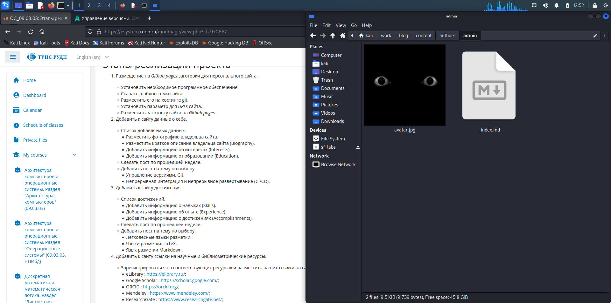
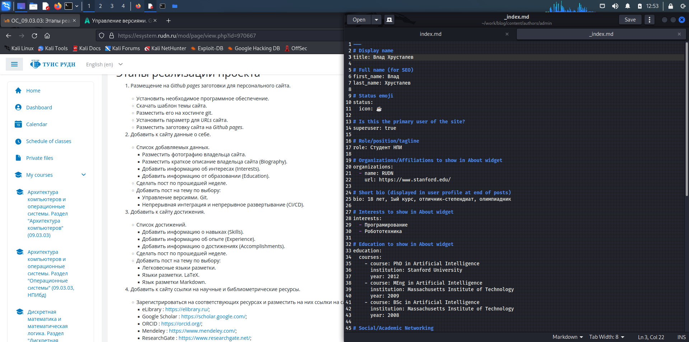
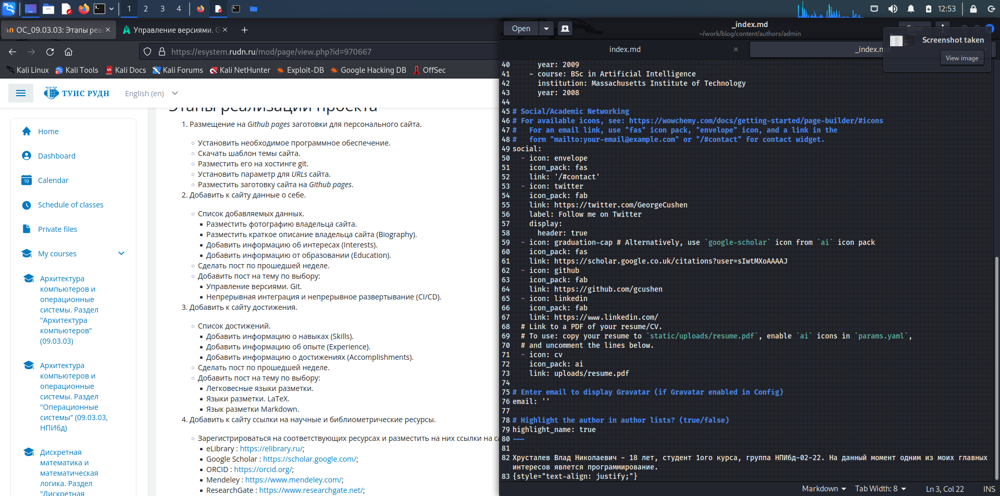
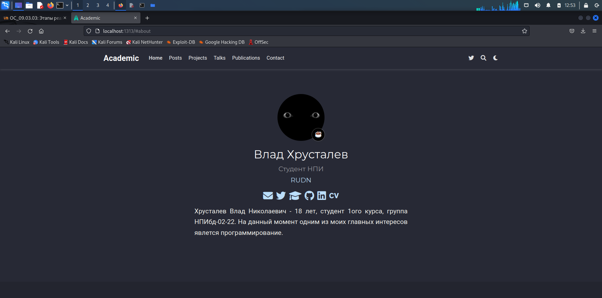
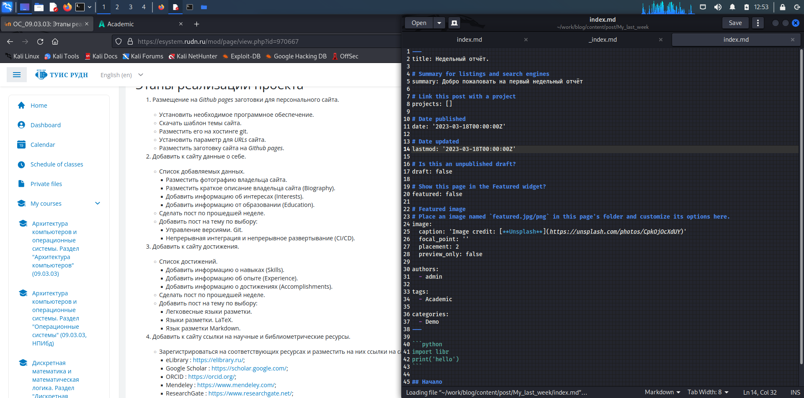
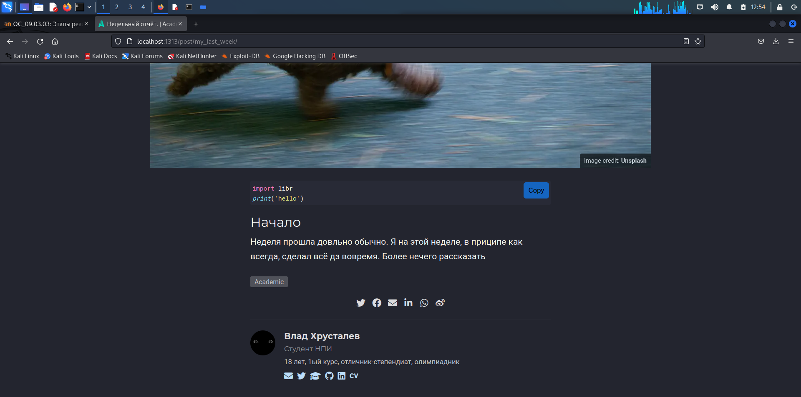
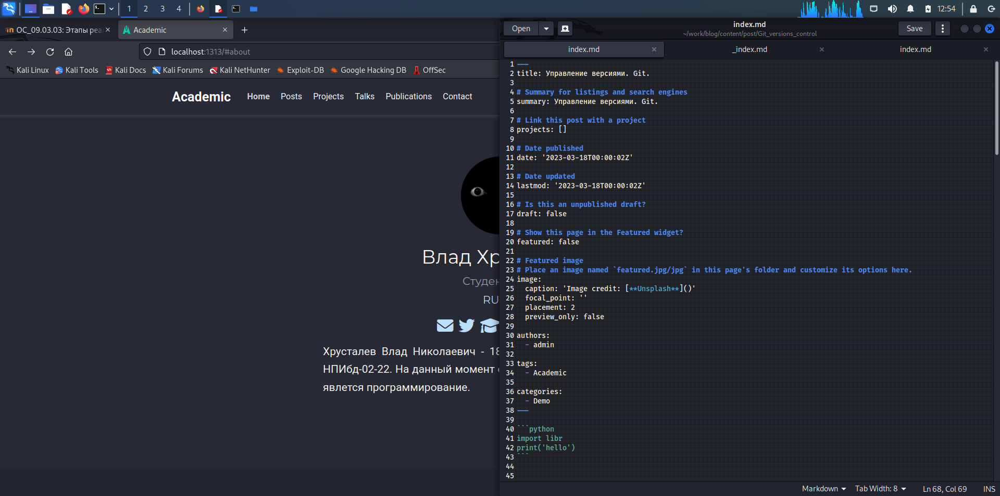
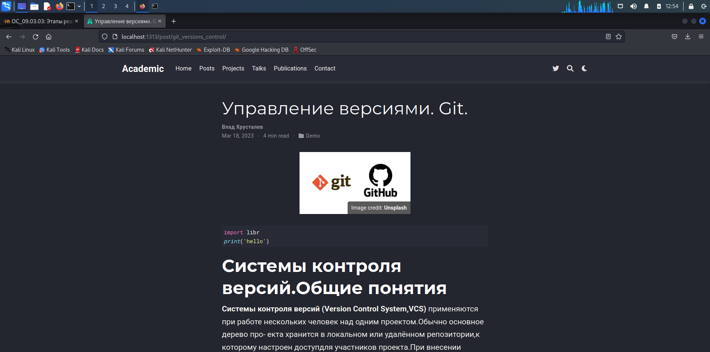

---
## Front matter
lang: ru-RU
title: Этап 2 по ИП
subtitle: Размещение на Github pages заготовки для персонального сайта
author:
  - Хрусталев В.Н.
institute:
  - Российский университет дружбы народов, Москва, Россия

## i18n babel
babel-lang: russian
babel-otherlangs: english

## Formatting pdf
toc: false
toc-title: Содержание
slide_level: 2
aspectratio: 169
section-titles: true
theme: metropolis
header-includes:
 - \metroset{progressbar=frametitle,sectionpage=progressbar,numbering=fraction}
 - '\makeatletter'
 - '\beamer@ignorenonframefalse'
 - '\makeatother'
---

# Информация

## Докладчик

:::::::::::::: {.columns align=center}
::: {.column width="70%"}

  * Хрусталев Влад Николаевич
  * Студент ФМиЕН РУДН
  * Группа НПИбд-02-22

:::
::: {.column width="30%"}

:::
::::::::::::::

# Вводная часть

## Цели и задачи

- Продолжение оформления сайта.

## Содержание исследования

- Добавление информации о себе

- Сделать пост по прошедшей неделе.

- Пост по выбору(Управление версиями. Git.)

## Добавление информации о себе

# Для начала заменим аватарку, для этого перейдём по пути blog/authors/admin . Заменим файл avatar.jpg на свою.

{#fig:001 width=70%}

# Далее для изменения описания "об авторе" требуется открыть в той же папке файл _index.md / тут мы в соответсвующих полях измениям текст. 

{#fig:002 width=70%}

{#fig:003 width=70%}

# Проверим изменения на запущенном сайте.

{#fig:004 width=70%}

## Сделать пост по прошедшей неделе.

# В свою очередь чтобы изменить(создать пост, требуется перейти в blog/content/post/ тут будет 3и папки. И каждая отвечает за отдельный пост. Удалим две лишние , одну оставим как образец. Изменим название папки образца. Далее перейдем в неё. Чтобы менять картинку основную , требуется заменить картинку в этой папке. В свою очередб в index.md мы можем менять содержание поста. Всё интуинтивно понятно.

{#fig:005 width=70%}

# Вот как выгдядит пост.

{#fig:006 width=70%}

## Пост по выбору(Управление версиями. Git.)

# Аналогично с прошлым пунктом создадим пост. В этот раз я скопировал мою папку с предыдущим постом, переименовал. В новой папку заменил картинку, а в файле index.md нужный текст.

{#fig:007 width=70%}

#Вот как выгдядит пост,

{#fig:008 width=70%}

# Итоги

## Вывод

- Продвинулись по оформлению личного блога

