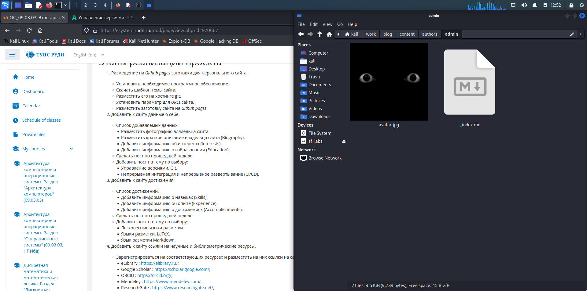
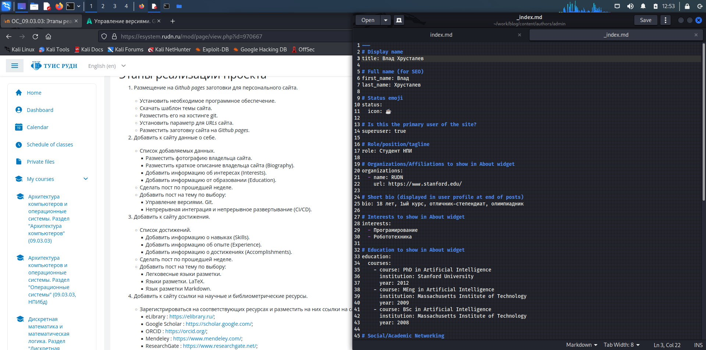
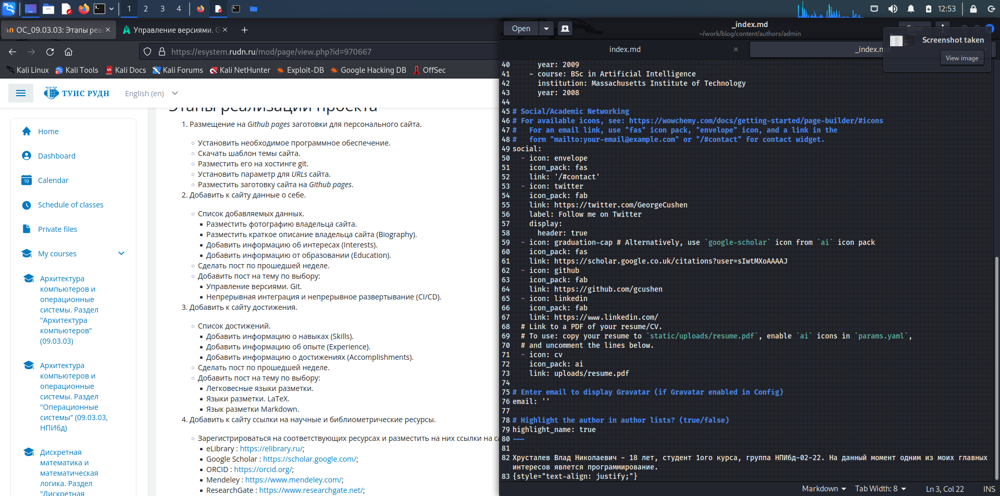
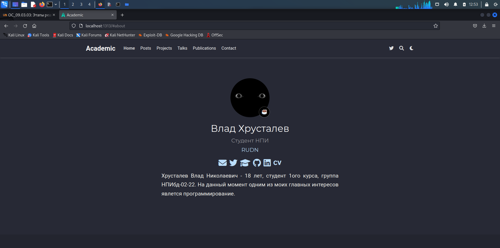
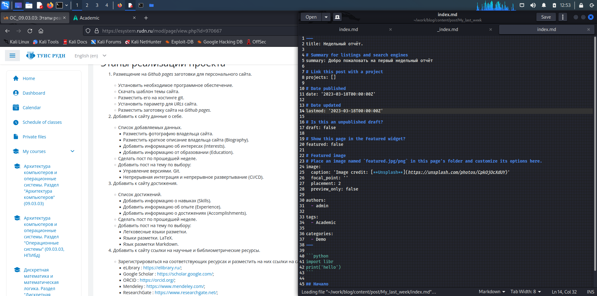
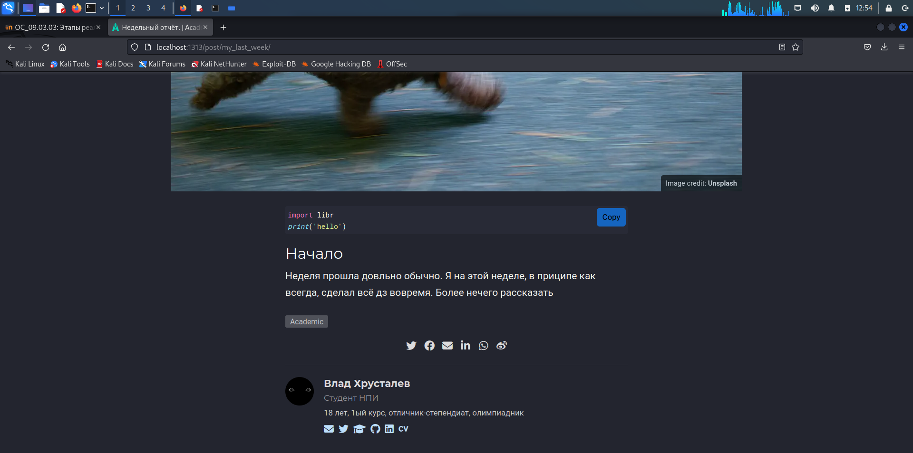
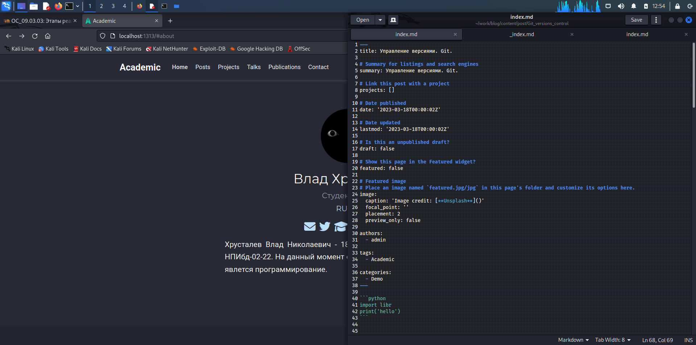
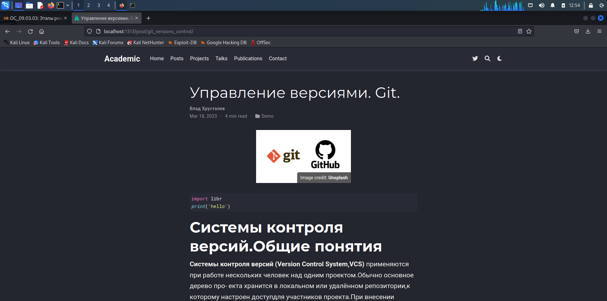

---
## Front matter
title: "Шаблон отчёта по лабораторной работе"
subtitle: "Простейший вариант"
author: "Дмитрий Сергеевич Кулябов"

## Generic otions
lang: ru-RU
toc-title: "Содержание"

## Bibliography
bibliography: bib/cite.bib
csl: pandoc/csl/gost-r-7-0-5-2008-numeric.csl

## Pdf output format
toc: true # Table of contents
toc-depth: 2
lof: true # List of figures
lot: true # List of tables
fontsize: 12pt
linestretch: 1.5
papersize: a4
documentclass: scrreprt
## I18n polyglossia
polyglossia-lang:
  name: russian
  options:
	- spelling=modern
	- babelshorthands=true
polyglossia-otherlangs:
  name: english
## I18n babel
babel-lang: russian
babel-otherlangs: english
## Fonts
mainfont: PT Serif
romanfont: PT Serif
sansfont: PT Sans
monofont: PT Mono
mainfontoptions: Ligatures=TeX
romanfontoptions: Ligatures=TeX
sansfontoptions: Ligatures=TeX,Scale=MatchLowercase
monofontoptions: Scale=MatchLowercase,Scale=0.9
## Biblatex
biblatex: true
biblio-style: "gost-numeric"
biblatexoptions:
  - parentracker=true
  - backend=biber
  - hyperref=auto
  - language=auto
  - autolang=other*
  - citestyle=gost-numeric
## Pandoc-crossref LaTeX customization
figureTitle: "Рис."
tableTitle: "Таблица"
listingTitle: "Листинг"
lofTitle: "Список иллюстраций"
lotTitle: "Список таблиц"
lolTitle: "Листинги"
## Misc options
indent: true
header-includes:
  - \usepackage{indentfirst}
  - \usepackage{float} # keep figures where there are in the text
  - \floatplacement{figure}{H} # keep figures where there are in the text
---

# Цель работы

Продолжение оформления сайта.

# Задание
1. Добавим:

- Разместить фотографию владельца сайта.

- Разместить краткое описание владельца сайта (Biography).

- Добавить информацию об интересах (Interests).

- Добавить информацию от образовании (Education).

2. Сделать пост по прошедшей неделе.
    
3. Добавить пост на тему по выбору:
- Управление версиями. Git.
- Непрерывная интеграция и непрерывное развертывание (CI/CD).

# Выполнение лабораторной работы

1. Данные о себе

Для начала заменим аватарку, для этого перейдём по пути blog/authors/admin . Заменим файл avatar.jpg на свою.(рис. @fig:001).

{#fig:001 width=70%}

Далее для изменения описания "об авторе" требуется открыть в той же папке файл _index.md / тут мы в соответсвующих полях измениям текст. (рис. @fig:002  и рис. @fig:003).

{#fig:002 width=70%}

{#fig:003 width=70%}

Проверим изменения на запущенном сайте.(рис. @fig:004).

{#fig:004 width=70%}

2. Делаем пост по прошедшей неделе.

В свою очередь чтобы изменить(создать пост, требуется перейти в blog/content/post/ тут будет 3и папки. И каждая отвечает за отдельный пост. Удалим две лишние , одну оставим как образец. Изменим название папки образца. Далее перейдем в неё. Чтобы менять картинку основную , требуется заменить картинку в этой папке. В свою очередб в index.md мы можем менять содержание поста. Всё интуинтивно понятно.(рис. @fig:005).

{#fig:005 width=70%}

Вот как выгдядит пост(рис. @fig:006).

{#fig:006 width=70%}

3. Добавить пост на тему по выбору

Я выбрал тему:

- Управление версиями. Git.

Аналогично с прошлым пунктом создадим пост. В этот раз я скопировал мою папку с предыдущим постом, переименовал. В новой папку заменил картинку, а в файле index.md нужный текст.(рис. @fig:007).

{#fig:007 width=70%}

Вот как выгдядит пост(рис. @fig:008).

{#fig:008 width=70%}

ГОТОВО!

# Выводы

Продвинулись по оформлению личного блога
