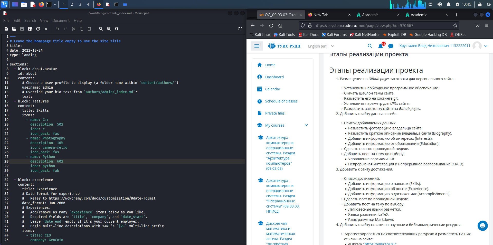
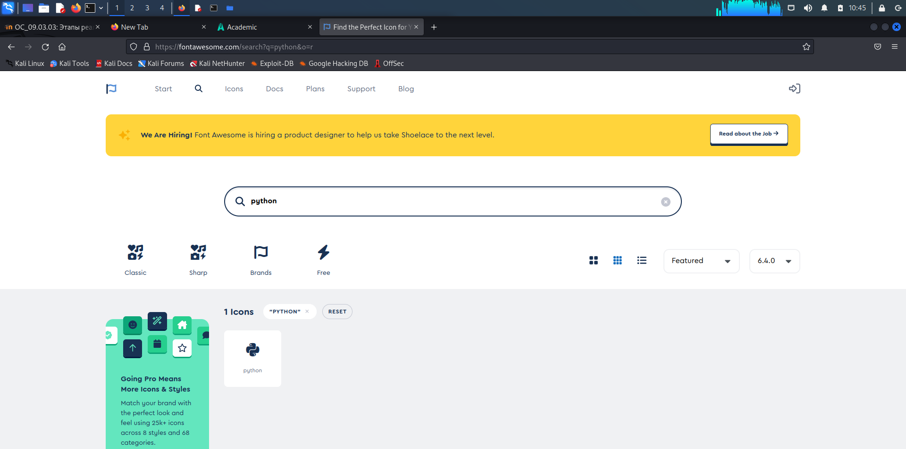
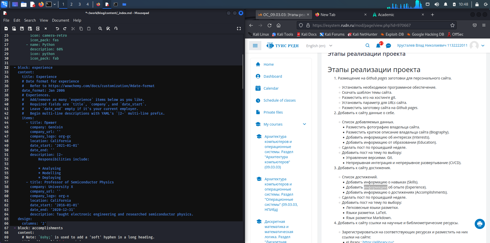
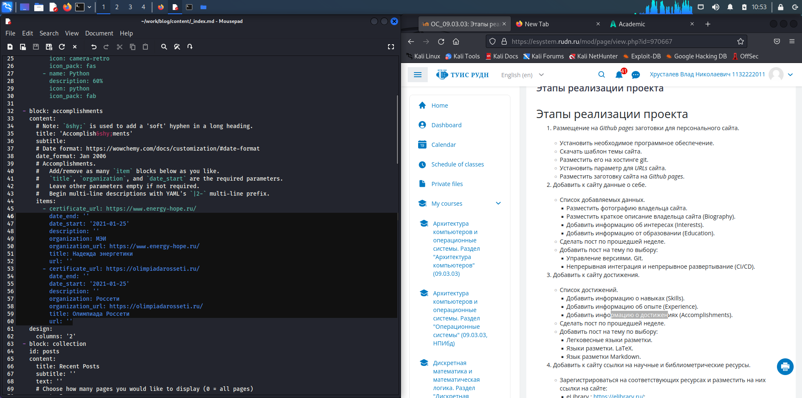
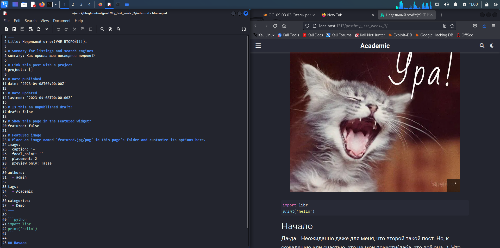
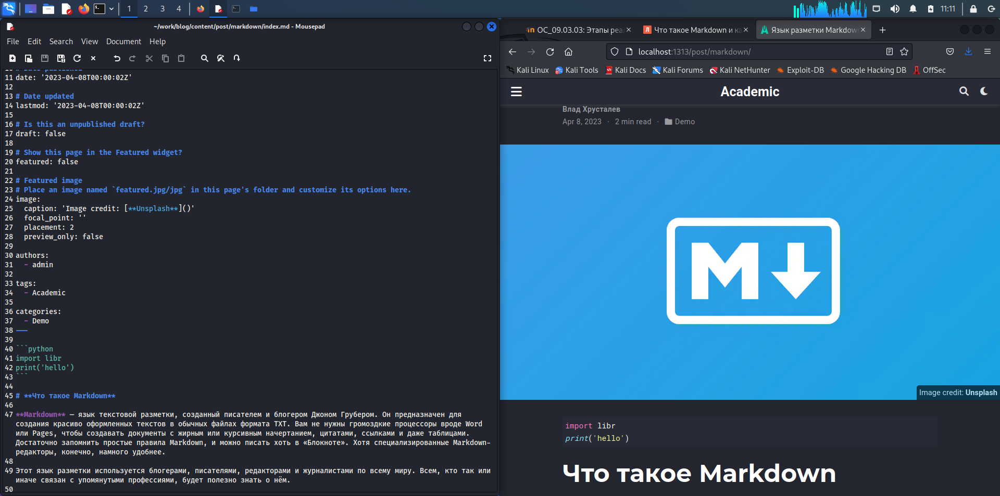

---
## Front matter
lang: ru-RU
title: Этап 3 по ИП
subtitle: Размещение на Github pages заготовки для персонального сайта
author:
  - Хрусталев В.Н.
institute:
  - Российский университет дружбы народов, Москва, Россия

## i18n babel
babel-lang: russian
babel-otherlangs: english

## Formatting pdf
toc: false
toc-title: Содержание
slide_level: 2
aspectratio: 169
section-titles: true
theme: metropolis
header-includes:
 - \metroset{progressbar=frametitle,sectionpage=progressbar,numbering=fraction}
 - '\makeatletter'
 - '\beamer@ignorenonframefalse'
 - '\makeatother'
---

# Информация

## Докладчик

:::::::::::::: {.columns align=center}
::: {.column width="70%"}

  * Хрусталев Влад Николаевич
  * Студент ФМиЕН РУДН
  * Группа НПИбд-02-22

:::
::: {.column width="30%"}

:::
::::::::::::::

# Вводная часть

## Цели и задачи

- Продолжение оформления сайта.

# Выполнение работы

## Запустим локаьный сервер hugo для параллельного контроля работы. Откроем файл content/_index.md - отредактируем пункт Skills.

{#fig:001 width=70%}

## В данном пункте мы можем использовать иконки, подходящие к умению, для этого переходим на сайт и находим название нужной иконки и вписываем в нужной строке

{#fig:002 width=70%}

## Аналагично пункту Skills , в этом же файле редактируем блок Experience

{#fig:003 width=70%}

## И по тому же методу меняем блок о достижениях Accomplishments

{#fig:004 width=70%}

## Переходим к более знакомому. Требуется добавить пост о неделе. Аналогично с Этапом 2 по ИП, пишем пост.

{#fig:005 width=70%}

## А так же я выбрал тему для 2-ого поста для этого этапа - Markdown. Пишем текст, меняем картинку и проверяем

{#fig:006 width=70%}

# Итоги

## Вывод

- Продвинулись по оформлению личного блога

