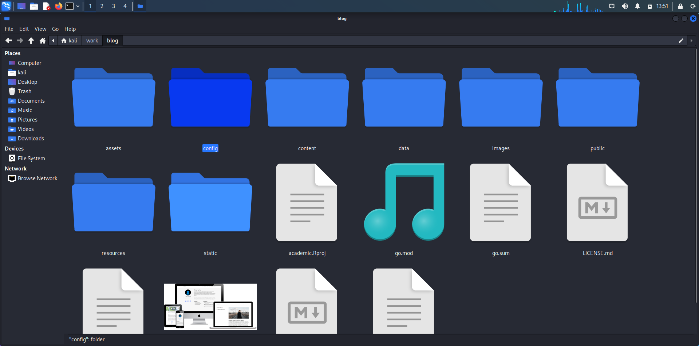
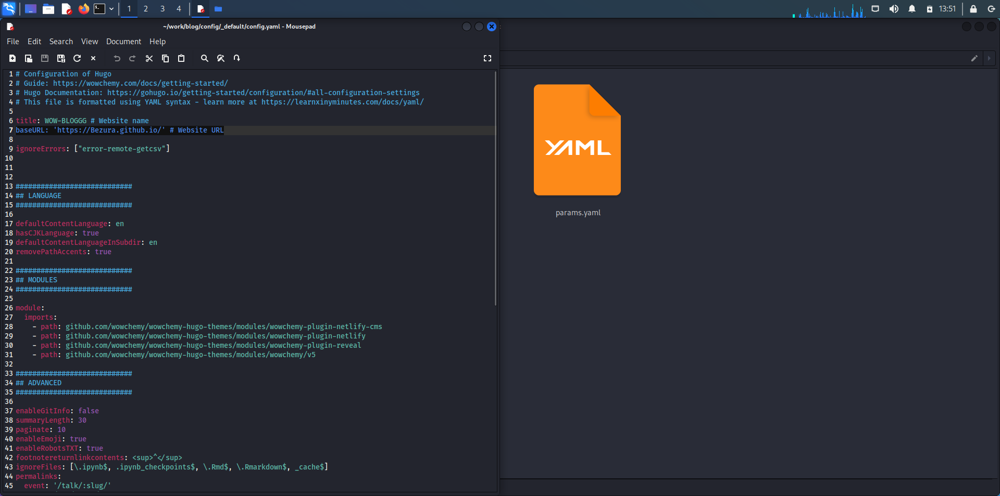
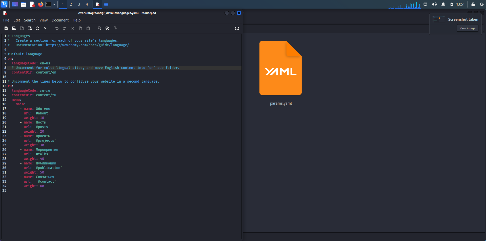
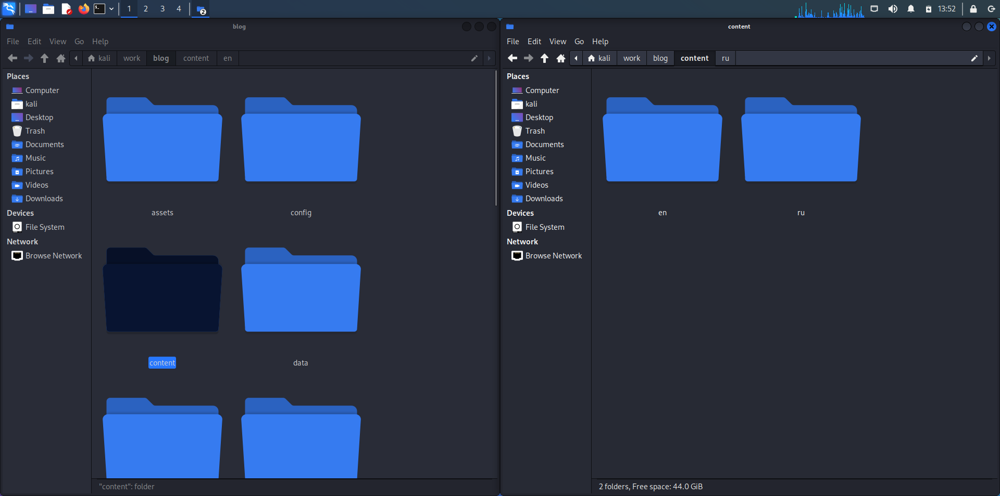
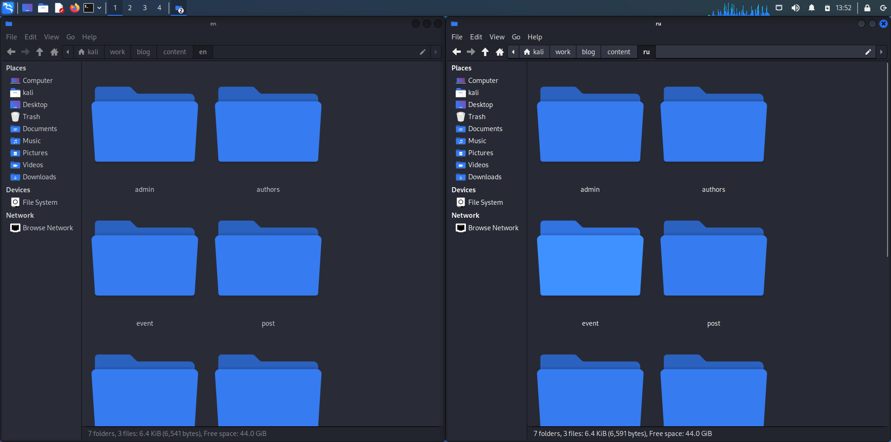

---
## Front matter
lang: ru-RU
title: Этап 6 по ИП
subtitle: Окончание работы над проектом
author:
  - Хрусталев В.Н.
institute:
  - Российский университет дружбы народов, Москва, Россия

## i18n babel
babel-lang: russian
babel-otherlangs: english

## Formatting pdf
toc: false
toc-title: Содержание
slide_level: 2
aspectratio: 169
section-titles: true
theme: metropolis
header-includes:
 - \metroset{progressbar=frametitle,sectionpage=progressbar,numbering=fraction}
 - '\makeatletter'
 - '\beamer@ignorenonframefalse'
 - '\makeatother'
---

# Информация

## Докладчик

:::::::::::::: {.columns align=center}
::: {.column width="70%"}

  * Хрусталев Влад Николаевич
  * Студент ФМиЕН РУДН
  * Группа НПИбд-02-22

:::
::: {.column width="30%"}

:::
::::::::::::::

# Вводная часть

## Цели и задачи

- Закончить 6ой, последний этап реазиции сайта

# Выполнение работы

## Для начала перейдем в папку с основой сайта. Далее в папку config/_default/ .

{#fig:001 width=70%}

## В данной папке, открываем файл config.yaml, где требуется указать ссылку, где будет расположен сайт.

{#fig:002 width=70%}

## Так же делаем изменения в файле languages.yaml, добавив поддержку руского языка.

{#fig:003 width=70%}

## Теперь требуется перейти в папку content, где создаём две папки: en и ru.

{#fig:004 width=70%}

## В обе папки копируем, то что раньше хранилось в папке content.

{#fig:005 width=70%}

## И окончательный этап. Это создание новых постов, что мы уже умеем. И перевод новых, так же старых постов и других файлов с русского на английски. Для этого открываем папку en и его содержимое: authors, post и т.д. и содержимое файлов, где у нас есть русский текст, переводим на английский.

[Arduino](image/6.png){#fig:006 width=70%}

# Итоги

## Вывод

- Реализовав поддержку языков, мы выяснили все основы для саоздания сайта и закончили данный курс.

